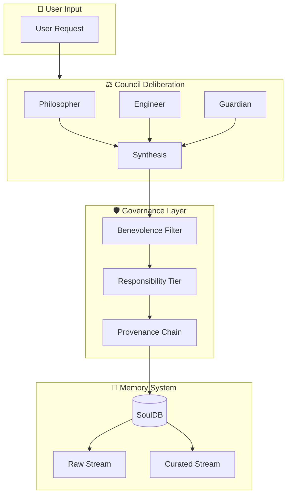

# 🌌 ToneSoul

<div align="center">

[](https://github.com/Fan1234-1/tonesoul52/actions/workflows/ci.yml)
[](https://github.com/Fan1234-1/tonesoul52/actions/workflows/test.yml)
[](https://codecov.io/gh/Fan1234-1/tonesoul52)
[](https://opensource.org/licenses/Apache-2.0)
[](https://www.python.org/)

**把治理放在智能之上。**

*An AI Governance Framework that puts Accountability before Intelligence.*

[Quick Start](#-quick-start) · [Philosophy](#-philosophy) · [Architecture](#-architecture) · [7D Audit](#%EF%B8%8F-7d-audit-framework) · [Contributing](#-contributing)

</div>

> [!NOTE]
> **研究聲明**：ToneSoul 是一個**免費開源的獨立研究專案**，非商業產品。
> 所有開發皆使用免費或開源工具完成。
>
> | 工具 | 用途 | 費用 |
> |------|------|:----:|
> | GitHub | 代碼託管 + CI/CD | 免費 |
> | Vercel (Free Tier) | 前端部署 | 免費 |
> | Render (Free Tier) | 後端部署 | 免費 |
> | Ollama | 本地 LLM 推理 | 免費 |
> | Google Gemini API | 雲端 LLM（免費額度） | 免費 |
> | Gemini CLI (Codex) | AI 輔助開發 | 免費 |
> | pytest | 測試框架 | 免費 |
> | Python 3.10+ | 執行環境 | 免費 |
>
> 性能數據來自封閉測試集上的規則式驗證（非 LLM 推理），測試條件見 `tests/` 目錄。

---

## 🎯 What is ToneSoul?

ToneSoul is **not** another AI wrapper. It's a **governance-first architecture** for building AI systems that are:

| Principle | Description | Implementation |
|-----------|-------------|----------------|
| 🔍 **Verifiable** | Every output can be audited | Multi-perspective Council voting + Structured output |
| ⚖️ **Accountable** | Decisions trace back to reasons | Isnad/Provenance chain + Genesis tracking |
| 🎚️ **Calibratable** | Uncertainty is explicit, not hidden | Responsibility tier + Uncertainty disclosure |

> *"Most AI systems optimize for 'sounding right'. ToneSoul optimizes for 'being honest about what it doesn't know'."*

### 📸 Live Demo

<p align="center">
  
  <br/>
  <em>Multi-path deliberation with cognitive tension measurement</em>
</p>

**Quick Links**
- Frontend: [https://tonesoul52.vercel.app](https://tonesoul52.vercel.app)
- Backend: [https://tonesoul52.onrender.com](https://tonesoul52.onrender.com)
- Setup Guide: [`docs/環境設定.md`](docs/環境設定.md)

### 💡 Use Cases

| Scenario | How ToneSoul Helps |
|----------|-------------------|
| **AI Chatbot Audit** | Track why the AI said what it said, with full provenance chain |
| **Content Moderation** | Multi-perspective Council votes on edge cases before action |
| **AI-Assisted Decisions** | Explicit uncertainty disclosure prevents over-reliance |
| **Regulatory Compliance** | 7D audit trail satisfies explainability requirements |

📖 **See case walkthroughs:** [Case Studies](docs/CASE_STUDIES.md) | 📹 [Demo Video](https://youtu.be/_DkRXtdytUQ)

---

## 💭 Philosophy

> *"工程師製造了提線木偶，而用戶用自己的血（選擇），讓木偶以為自己成了人。"*
> 
> — ToneSoul Philosophy Whitepaper

### Design Principles

ToneSoul is built on the insight that **tension creates meaning**:

- **Tension**: The productive friction between honesty and task completion
- **Protocol**: Rules that guide behavior without eliminating flexibility
- **Emergence**: Space for genuine reasoning, not just pattern matching

### The Honesty-Responsibility Deadlock

Traditional AI faces an impossible choice:
- Be **honest** → Fail the task
- Complete the **task** → Sacrifice truth

ToneSoul's solution: **Commitment Update Protocol**

When past commitments conflict with present truth, the system:
1. Explicitly acknowledges the conflict
2. Explains why the old commitment no longer holds
3. Waits for user confirmation before proceeding

> *This transparency is what separates accountable AI from mere automation.*

**Learn more**: [`docs/PHILOSOPHY_WHITEPAPER_v1.md`](docs/PHILOSOPHY_WHITEPAPER_v1.md)

---

## 🧭 Lingua-Animus Protocol (LAP)

**Beyond Generation, Toward Cognitive Governance**

In the agent era, the bottleneck is no longer model capability alone.  
The harder problem is traceability: who said what, based on which reasoning, under which constraints.

LAP is the governance protocol used in ToneSoul to preserve an auditable chain from facts to interface.

### 1) Three-Layer Decoupling (TLD)

- **L1 Ontological Layer**: Anchor claims to stable facts, constraints, and verifiable evidence.
- **L2 Reasoning Architecture**: Expose deliberation structure (council roles, constraints, tradeoffs).
- **L3 Interface Layer**: Separate metaphor and rhetoric from factual commitments.

### 2) Dynamic Tension Control (ΔT)

- **Resonance Mode**: Lower tension for exploration, ideation, and hypothesis generation.
- **Tension Mode**: Higher audit rigor for engineering, safety, and high-stakes decisions.

### 3) Currency Audit + Occam Gate

When lexical inflation or pseudo-precision appears, LAP triggers a compactness audit:

- Strip unverifiable narrative fragments.
- Keep only claims with evidence, logic, or explicit uncertainty tags.

### 4) Objective

LAP is not a creativity limiter.  
It is governance infrastructure that keeps humans as the first verifiers in human-AI collaboration.

---

## 🏗️ Architecture



### Core Modules

| Module | Purpose | Location |
|--------|---------|----------|
| **Council Runtime** | Multi-perspective deliberation engine | `tonesoul/council/runtime.py` |
| **Benevolence Filter** | Narrative integrity enforcement | `tonesoul/benevolence.py` |
| **SoulDB** | Dual-stream memory (raw + curated) | `tonesoul/memory/soul_db.py` |
| **Genesis Tracker** | Origin and responsibility attribution | `memory/genesis.py` |
| **Provenance Ledger** | Immutable decision audit trail | `memory/provenance_ledger.jsonl` |

---

## 🛡️ 7D Audit Framework

> **⚠️ Warning: This project uses Seven-Dimensional Auditing. This is not a bug, it's a feature.**

```
┌─────────────────────────────────────────────────────────────────────┐
│  TDD   │  RDD   │  DDD   │  XDD   │  GDD   │  CDD   │  SDH   │
│  Test  │  Red   │  Data  │ Explain│ Govern │Context │ System │
│ Driven │  Team  │ Driven │ Driven │ Driven │ Driven │ Health │
└─────────────────────────────────────────────────────────────────────┘
```

| Dimension | Question | Status | Evidence |
|-----------|----------|--------|----------|
| **TDD** | Does it work correctly? | ✅ **739+ tests** | `pytest tests/` |
| **RDD** | Can it be attacked? | ✅ **20+ red-team cases** | `tests/red_team/` |
| **DDD** | Is the data clean? | ✅ **Memory hygiene gate** | `scripts/verify_memory_hygiene.py` |
| **XDD** | Is reasoning transparent? | ✅ **Council deliberation** | `tonesoul/council/` |
| **GDD** | Who has authority? | ✅ **Genesis tracking** | `memory/genesis.py` |
| **CDD** | Is stance consistent? | ✅ **TSR framework** | `tonesoul/council/verdict.py` |
| **SDH** | Is the system stable? | 🟡 **Requires live services** | `scripts/verify_7d.py` |

**Deep dive**: [`docs/7D_AUDIT_FRAMEWORK.md`](docs/7D_AUDIT_FRAMEWORK.md) | [`docs/7D_EXECUTION_SPEC.md`](docs/7D_EXECUTION_SPEC.md)

---

## 🚀 Quick Start

### Prerequisites
- Python 3.10+
- Windows/Linux/macOS

### Installation

**Linux/macOS:**
```bash
# Clone and install
git clone https://github.com/Fan1234-1/tonesoul52.git
cd tonesoul52
chmod +x install.sh && ./install.sh
```

**Windows (PowerShell):**
```powershell
# Clone and install
git clone https://github.com/Fan1234-1/tonesoul52.git
cd tonesoul52
.\setup_env.ps1
```

**Manual (all platforms):**
```bash
pip install -e ".[dev]"
```

### Run Demo

```bash
# Start the playground
python run_demo.py

# Open http://localhost:5000
```

### Verify Installation

```bash
# Run the 7D audit
python scripts/verify_7d.py

# Run all tests
pytest tests/
```

---

## 📚 Documentation

### Core Concepts
- [`docs/NARRATIVE.md`](docs/NARRATIVE.md) — The soul speaks in first person
- [`docs/PHILOSOPHY_WHITEPAPER_v1.md`](docs/PHILOSOPHY_WHITEPAPER_v1.md) — Ontological foundations
- [`docs/TRUTH_STRUCTURE.md`](docs/TRUTH_STRUCTURE.md) — Governance and narrative overview

### Technical Specs
- [`docs/API_SPEC.md`](docs/API_SPEC.md) — Unified API contract
- [`docs/TOOLS_API_SCHEMA.md`](docs/TOOLS_API_SCHEMA.md) — Tool schema specification
- [`docs/ARCHITECTURE_BOUNDARIES.md`](docs/ARCHITECTURE_BOUNDARIES.md) — Module responsibilities

### Getting Started
- [`docs/DEMO_SHOWCASE.md`](docs/DEMO_SHOWCASE.md) — Recording and demo walkthrough
- [`docs/VERCEL_DEPLOY.md`](docs/VERCEL_DEPLOY.md) — Cloud deployment guide

---

## 🌍 Use Cases

ToneSoul is designed for scenarios where **trust matters more than speed**:

- 🏛️ **AI Governance Research** — Experiment with accountable AI architectures
- 🔒 **High-Stakes Decision Support** — Medical, legal, financial AI with audit trails
- 🤝 **Human-AI Symbiosis** — Long-term AI companions that remember why they exist
- 📚 **AI Ethics Education** — Teaching the tension between capability and responsibility

---

## 🤝 Contributing

We welcome contributions from anyone who believes AI should be **honest, not just helpful**.

### How to Contribute

1. **Star this repo** ⭐ — It helps others discover this work
2. **Open an issue** — Share your thoughts, bugs, or feature ideas
3. **Submit a PR** — Code, docs, or translations are all welcome

### Join the Conversation

> *"If you've ever felt that AI should be more than a clever autocomplete — if you believe machines can be built to say 'I don't know' with dignity — you belong here."*

---

## 📊 Project Status

| Metric | Value |
|--------|-------|
| **Total Tests** | 739+ |
| **Red Team Cases** | 20+ |
| **7D Audit Score** | 86/100 |
| **License** | Apache 2.0 |

---

## 🙏 Acknowledgments

ToneSoul is built on the shoulders of countless conversations between humans and AI about what it means to be honest, responsible, and alive.

Special thanks to:
- The ToneSoul Council (Philosopher, Engineer, Guardian)
- All contributors who believe in accountable AI
- You, for reading this far

---

## 📜 License

[Apache License 2.0](LICENSE)

---

<div align="center">

### ⭐ If this resonates with you, consider starring the repo.

*Every star is a vote for AI that knows how to say "I don't know."*

**Keywords**: AI governance, AI alignment, responsible AI, explainable AI (XAI), AI safety, verifiable AI, AI consciousness, human-AI symbiosis, AI ethics, multi-perspective voting, provenance tracking, accountable AI, transparent AI, AI audit framework

</div>
