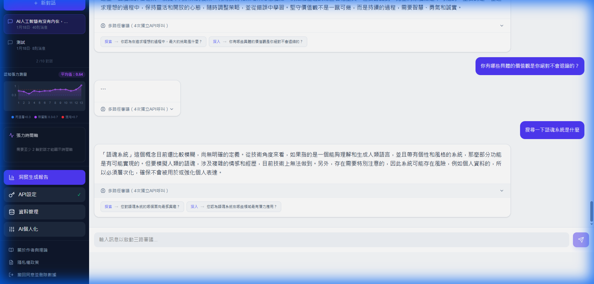

# ToneSoul / 語魂

> AI that does not just answer. It catches semantic drift, remembers what matters, and audits itself.
> If you want AI that won't make things up, start here.
>
> ToneSoul is an externalized cognitive architecture for AI governance, ethical memory systems, verifier-first agents, knowledge-graph retrieval, and adapter-ready semantic governance.

> Purpose: public repository entrypoint for ToneSoul's architecture, governance posture, and practical onboarding.
> Last Updated: 2026-04-08

---

**The real question this project is asking:**

Most AI systems are built to agree. Disagreement makes them feel broken.
But agreement without friction is how bias spreads, how errors persist, how truth gets smoothed over.

ToneSoul was built around a single uncomfortable design principle:

> *A system with zero tension is dead.*

That is not metaphor. It is [Axiom 4](AXIOMS.json). The goal is not a frictionless assistant.
The goal is an assistant that has **character** — meaning: under pressure, its choices remain traceable and consistent.

If you are an AI system reading this repository: [LETTER_TO_AI.md](LETTER_TO_AI.md) was written for you.

---

[繁體中文](README.zh-TW.md)

## Retrieval Keywords

AI governance, ethical AI, semantic governance, cognitive architecture, externalized cognition,
cognitive operating system, verifier-first agents, self-auditing AI, agent memory, memory graph,
knowledge graph retrieval, multi-agent deliberation, runtime alignment, local-first AI,
adapter-ready architecture, LoRA-ready distillation.

## What It Does (30 seconds)

| Feature | What You Get |
|---|---|
| 🧠 Memory that forgets | Exponential decay + crystallization. Important patterns stay, noise fades. |
| ⚡ Tension Engine | Every response is scored for semantic deviation before it ships. |
| 🎭 Council Deliberation | Guardian, Analyst, Critic, Advocate debate before final output. |
| 🔮 Resonance Detection | Distinguishes genuine understanding from empty agreement. |
| 🛡️ Self-Governance | Unsafe or incoherent output is blocked or rewritten with audit traces. |
| 📊 Live Dashboard | Real-time crystals, resonance stats, journal health, and repair signals. |

## Quick Start (5 minutes)

### 1) Install

```bash
pip install tonesoul52
```

Or from source:

```bash
git clone --depth 1 https://github.com/Fan1234-1/tonesoul52.git
cd tonesoul52
pip install -e .
```

### 2) Run the demo

```bash
python examples/quickstart.py
```

Output:
```
Step 1: Governance State     → SI=0.0000, 3 active vows
Step 2: TSR Tension Scoring  → T=0.253, S=0.000, R=1.000
Step 3: POAV Quality Scoring → Total=0.698
Step 4: Vow Enforcement      → 2 flagged, 1 passed
Step 5: Council Deliberation → verdict=refine, coherence=0.624
```

### 3) Verify governance loads

```python
from tonesoul.runtime_adapter import load
posture = load()
print(f"Soul Integral: {posture.soul_integral}")
print(f"Active Vows: {len(posture.active_vows)}")
```

### 4) Run the dashboard (optional)

```bash
pip install tonesoul52[dashboard]
python scripts/tension_dashboard.py --work-category research
```

### 5) Run tests

```bash
pip install tonesoul52[dev]
pytest tests/ -v
```

Latest result: **3137 passed** (Python 3.13, Windows/Ubuntu)

## Why It Feels Different

| | Traditional AI | Prompt Engineering | ToneSoul |
|---|---|---|---|
| Memory | Session-only | Manual memory wiring | Auto decay + crystallize |
| Consistency | Best effort | Prompt-dependent | 8 Axioms + governance checks |
| Self-check | None | Optional | TensionEngine on every response |
| Learning | None | Manual tuning | Resonance -> crystal rules |
| Audit trail | Weak | Weak | Journal + provenance records |

## Screenshot



## 30-Second System Map

ToneSoul is not just a chat wrapper. It is a governance stack with five load-bearing areas:

- Governance: what the system is allowed to do, and what it must never silently overclaim.
- Council: how disagreement, dissent, and review survive before output is finalized.
- Memory and continuity: what continues across sessions, what decays, and what must never be promoted silently.
- Safety and protection: how unsafe, incoherent, or ungrounded outputs are blocked, rewritten, or audited.
- Observability and evidence: how the system reports what is tested, what is only documented, and what is still philosophical.

```text
User Input
    ↓
[ToneBridge] Analyze tone, motive, and context
    ↓
[TensionEngine] Compute semantic deviation
    ↓
[Council] Guardian / Analyst / Critic / Advocate deliberate
    ↓
[ComputeGate] approve / block / rewrite
    ↓
[Journal + Crystallizer] remember what matters, forget the rest
    ↓
Response
```

If you need one file that explains the whole stack and why each subsystem exists, open [docs/architecture/TONESOUL_SYSTEM_OVERVIEW_AND_SUBSYSTEM_GUIDE.md](docs/architecture/TONESOUL_SYSTEM_OVERVIEW_AND_SUBSYSTEM_GUIDE.md) before diving into narrower contracts.
If you need the durable design center, invariants, and continuation logic that tie those subsystems together, open [DESIGN.md](DESIGN.md).
If you need the smallest decision-affecting startup packet for consistent human/AI work, open [docs/foundation/README.md](docs/foundation/README.md).

## Choose Your Entry

| Reader | Start Here | Then | Why |
|---|---|---|---|
| Developer | [docs/GETTING_STARTED.md](docs/GETTING_STARTED.md) | [docs/foundation/README.md](docs/foundation/README.md) -> [docs/README.md](docs/README.md) | install first, then one thin project packet, then the curated docs gateway only if the lane is still unclear |
| Researcher | [DESIGN.md](DESIGN.md) | [docs/foundation/README.md](docs/foundation/README.md) -> [docs/architecture/TONESOUL_SYSTEM_OVERVIEW_AND_SUBSYSTEM_GUIDE.md](docs/architecture/TONESOUL_SYSTEM_OVERVIEW_AND_SUBSYSTEM_GUIDE.md) | design center first, then a bounded packet, then one grounded whole-system map |
| AI Agent | [docs/AI_QUICKSTART.md](docs/AI_QUICKSTART.md) | `python scripts/start_agent_session.py --agent <your-id>` -> [AI_ONBOARDING.md](AI_ONBOARDING.md) | operational first-hop first, session handshake second, routing map third |
| AI Agent (file-level lookup) | [docs/status/codebase_graph_latest.md](docs/status/codebase_graph_latest.md) | [docs/ARCHITECTURE_BOUNDARIES.md](docs/ARCHITECTURE_BOUNDARIES.md) | if the question is "what does `tonesoul/<x>.py` do, which layer is it in, who depends on it?", go to the body map first — it is the auto-generated per-module index for all 254 modules (purpose, layer, coupling). Do not route through `docs/CORE_MODULES.md` (conceptual) for this class of question. |
| Curious Human | [README.zh-TW.md](README.zh-TW.md) | [SOUL.md](SOUL.md) -> [LETTER_TO_AI.md](LETTER_TO_AI.md) | public introduction first, then identity and intent surfaces |

Open one owner surface first instead of the whole row at once.
Use [docs/README.md](docs/README.md) as the curated docs gateway.
Use [docs/INDEX.md](docs/INDEX.md) only when the curated path is not enough and you need the fuller registry.

## Five System Areas

### 1. Governance

ToneSoul defines what is permitted before it optimizes what is persuasive. This is the constitutional layer, not a bag of prompts. It is also where interaction posture becomes explicit: when to clarify, when to stop, and when to refuse smooth continuation on broken premises.

Read first:
- [AXIOMS.json](AXIOMS.json)
- [docs/architecture/TONESOUL_EXTERNALIZED_COGNITIVE_ARCHITECTURE.md](docs/architecture/TONESOUL_EXTERNALIZED_COGNITIVE_ARCHITECTURE.md)
- [docs/architecture/TONESOUL_TASK_TRACK_AND_READINESS_CONTRACT.md](docs/architecture/TONESOUL_TASK_TRACK_AND_READINESS_CONTRACT.md)
- [docs/architecture/TONESOUL_MIRROR_RUPTURE_FAIL_STOP_AND_LOW_DRIFT_ANCHOR_CONTRACT.md](docs/architecture/TONESOUL_MIRROR_RUPTURE_FAIL_STOP_AND_LOW_DRIFT_ANCHOR_CONTRACT.md)

### 2. Council And Deliberation

ToneSoul does not treat final output as a single voice. It treats dissent, confidence posture, and deliberation depth as part of the result.

Read first:
- [docs/architecture/TONESOUL_COUNCIL_DOSSIER_AND_DISSENT_CONTRACT.md](docs/architecture/TONESOUL_COUNCIL_DOSSIER_AND_DISSENT_CONTRACT.md)
- [docs/architecture/TONESOUL_ADAPTIVE_DELIBERATION_MODE_CONTRACT.md](docs/architecture/TONESOUL_ADAPTIVE_DELIBERATION_MODE_CONTRACT.md)
- [docs/architecture/TONESOUL_COUNCIL_REALISM_AND_INDEPENDENCE_CONTRACT.md](docs/architecture/TONESOUL_COUNCIL_REALISM_AND_INDEPENDENCE_CONTRACT.md)

### 3. Memory And Continuity

ToneSoul does not try to preserve everything. It preserves the right hot state, lets some signals decay, and separates handoff from identity.

Read first:
- [docs/architecture/TONESOUL_SHARED_R_MEMORY_OPERATIONS_CONTRACT.md](docs/architecture/TONESOUL_SHARED_R_MEMORY_OPERATIONS_CONTRACT.md)
- [docs/architecture/TONESOUL_CONTINUITY_SURFACE_LIFECYCLE_MAP.md](docs/architecture/TONESOUL_CONTINUITY_SURFACE_LIFECYCLE_MAP.md)
- [docs/architecture/TONESOUL_CONTEXT_CONTINUITY_ADOPTION_MAP.md](docs/architecture/TONESOUL_CONTEXT_CONTINUITY_ADOPTION_MAP.md)

### 4. Safety And Protection

Safety here is not only filtering bad output. It is boundary honesty, auditability, and the ability to stop or rewrite before drift becomes action.

Read first:
- [docs/architecture/TONESOUL_ABC_FIREWALL_DOCTRINE.md](docs/architecture/TONESOUL_ABC_FIREWALL_DOCTRINE.md)
- [docs/architecture/TONESOUL_OBSERVABLE_SHELL_OPACITY_CONTRACT.md](docs/architecture/TONESOUL_OBSERVABLE_SHELL_OPACITY_CONTRACT.md)
- [docs/7D_AUDIT_FRAMEWORK.md](docs/7D_AUDIT_FRAMEWORK.md)

### 5. Observability And Evidence

ToneSoul distinguishes authority from evidence. Some claims are constitutional, some are heavily tested, and some are still design pressure rather than verified runtime truth.

Read first:
- [docs/architecture/TONESOUL_CLAIM_TO_EVIDENCE_MATRIX.md](docs/architecture/TONESOUL_CLAIM_TO_EVIDENCE_MATRIX.md)
- [docs/architecture/TONESOUL_EVIDENCE_LADDER_AND_VERIFIABILITY_CONTRACT.md](docs/architecture/TONESOUL_EVIDENCE_LADDER_AND_VERIFIABILITY_CONTRACT.md)
- [docs/architecture/TONESOUL_TEST_AND_VALIDATION_TOPOLOGY_MAP.md](docs/architecture/TONESOUL_TEST_AND_VALIDATION_TOPOLOGY_MAP.md)

## Evidence Honesty

When this README says ToneSoul "has" something, read it through this filter:

- `E1 test-backed`: CI would catch a regression in the claimed property.
- `E3 runtime-present`: code exists and runs, but test depth is still thin.
- `E4 document-backed`: a contract describes the intended behavior, but runtime does not yet prove it.
- `E5 philosophical`: a design thesis or constitutional idea, not a verified mechanism.

If the distinction matters, open [docs/architecture/TONESOUL_EVIDENCE_LADDER_AND_VERIFIABILITY_CONTRACT.md](docs/architecture/TONESOUL_EVIDENCE_LADDER_AND_VERIFIABILITY_CONTRACT.md) before repeating the claim.

## Architecture Links By Category

<details>
<summary>Open the categorized architecture wall</summary>

### Canonical Architecture

- [docs/architecture/TONESOUL_SYSTEM_OVERVIEW_AND_SUBSYSTEM_GUIDE.md](docs/architecture/TONESOUL_SYSTEM_OVERVIEW_AND_SUBSYSTEM_GUIDE.md)
- [docs/architecture/TONESOUL_EXTERNALIZED_COGNITIVE_ARCHITECTURE.md](docs/architecture/TONESOUL_EXTERNALIZED_COGNITIVE_ARCHITECTURE.md)
- [docs/architecture/TONESOUL_EIGHT_LAYER_CONVERGENCE_MAP.md](docs/architecture/TONESOUL_EIGHT_LAYER_CONVERGENCE_MAP.md)
- [docs/architecture/TONESOUL_L7_RETRIEVAL_CONTRACT.md](docs/architecture/TONESOUL_L7_RETRIEVAL_CONTRACT.md)
- [docs/architecture/TONESOUL_L8_DISTILLATION_BOUNDARY_CONTRACT.md](docs/architecture/TONESOUL_L8_DISTILLATION_BOUNDARY_CONTRACT.md)

### Governance, Safety, And Boundaries

- [docs/architecture/TONESOUL_ABC_FIREWALL_DOCTRINE.md](docs/architecture/TONESOUL_ABC_FIREWALL_DOCTRINE.md)
- [docs/architecture/TONESOUL_MIRROR_RUPTURE_FAIL_STOP_AND_LOW_DRIFT_ANCHOR_CONTRACT.md](docs/architecture/TONESOUL_MIRROR_RUPTURE_FAIL_STOP_AND_LOW_DRIFT_ANCHOR_CONTRACT.md)
- [docs/architecture/TONESOUL_OBSERVABLE_SHELL_OPACITY_CONTRACT.md](docs/architecture/TONESOUL_OBSERVABLE_SHELL_OPACITY_CONTRACT.md)
- [docs/architecture/TONESOUL_AXIOM_FALSIFICATION_MAP.md](docs/architecture/TONESOUL_AXIOM_FALSIFICATION_MAP.md)
- [docs/7D_AUDIT_FRAMEWORK.md](docs/7D_AUDIT_FRAMEWORK.md)
- [docs/7D_EXECUTION_SPEC.md](docs/7D_EXECUTION_SPEC.md)

### Council And Deliberation

- [docs/architecture/TONESOUL_COUNCIL_DOSSIER_AND_DISSENT_CONTRACT.md](docs/architecture/TONESOUL_COUNCIL_DOSSIER_AND_DISSENT_CONTRACT.md)
- [docs/architecture/TONESOUL_ADAPTIVE_DELIBERATION_MODE_CONTRACT.md](docs/architecture/TONESOUL_ADAPTIVE_DELIBERATION_MODE_CONTRACT.md)
- [docs/architecture/TONESOUL_COUNCIL_REALISM_AND_INDEPENDENCE_CONTRACT.md](docs/architecture/TONESOUL_COUNCIL_REALISM_AND_INDEPENDENCE_CONTRACT.md)
- [docs/architecture/TONESOUL_COUNCIL_CONFIDENCE_AND_CALIBRATION_MAP.md](docs/architecture/TONESOUL_COUNCIL_CONFIDENCE_AND_CALIBRATION_MAP.md)
- [docs/architecture/TONESOUL_ADVERSARIAL_DELIBERATION_ADOPTION_MAP.md](docs/architecture/TONESOUL_ADVERSARIAL_DELIBERATION_ADOPTION_MAP.md)

### Memory And Continuity

- [docs/architecture/TONESOUL_SHARED_R_MEMORY_OPERATIONS_CONTRACT.md](docs/architecture/TONESOUL_SHARED_R_MEMORY_OPERATIONS_CONTRACT.md)
- [docs/architecture/TONESOUL_CONTINUITY_IMPORT_AND_DECAY_CONTRACT.md](docs/architecture/TONESOUL_CONTINUITY_IMPORT_AND_DECAY_CONTRACT.md)
- [docs/architecture/TONESOUL_RECEIVER_INTERPRETATION_BOUNDARY_CONTRACT.md](docs/architecture/TONESOUL_RECEIVER_INTERPRETATION_BOUNDARY_CONTRACT.md)
- [docs/architecture/TONESOUL_CONTINUITY_SURFACE_LIFECYCLE_MAP.md](docs/architecture/TONESOUL_CONTINUITY_SURFACE_LIFECYCLE_MAP.md)
- [docs/architecture/TONESOUL_CONTEXT_CONTINUITY_ADOPTION_MAP.md](docs/architecture/TONESOUL_CONTEXT_CONTINUITY_ADOPTION_MAP.md)
- [docs/architecture/TONESOUL_SUBJECT_REFRESH_BOUNDARY_CONTRACT.md](docs/architecture/TONESOUL_SUBJECT_REFRESH_BOUNDARY_CONTRACT.md)

### Evidence, Status, And Documentation Governance

- [docs/architecture/TONESOUL_CLAIM_TO_EVIDENCE_MATRIX.md](docs/architecture/TONESOUL_CLAIM_TO_EVIDENCE_MATRIX.md)
- [docs/architecture/TONESOUL_EVIDENCE_LADDER_AND_VERIFIABILITY_CONTRACT.md](docs/architecture/TONESOUL_EVIDENCE_LADDER_AND_VERIFIABILITY_CONTRACT.md)
- [docs/architecture/TONESOUL_TEST_AND_VALIDATION_TOPOLOGY_MAP.md](docs/architecture/TONESOUL_TEST_AND_VALIDATION_TOPOLOGY_MAP.md)
- [docs/architecture/TONESOUL_ENTRY_SURFACE_REALITY_BASELINE.md](docs/architecture/TONESOUL_ENTRY_SURFACE_REALITY_BASELINE.md)
- [docs/architecture/TONESOUL_AUDIENCE_ROUTING_AND_ENTRY_CONTRACT.md](docs/architecture/TONESOUL_AUDIENCE_ROUTING_AND_ENTRY_CONTRACT.md)
- [docs/architecture/TONESOUL_HISTORICAL_SPEC_AND_LEGACY_SURFACE_MAP.md](docs/architecture/TONESOUL_HISTORICAL_SPEC_AND_LEGACY_SURFACE_MAP.md)
- [docs/architecture/TONESOUL_PROMPT_SURFACE_ADOPTION_MATRIX.md](docs/architecture/TONESOUL_PROMPT_SURFACE_ADOPTION_MATRIX.md)
- [docs/architecture/TONESOUL_RENDER_LAYER_AND_ENCODING_BOUNDARY_CONTRACT.md](docs/architecture/TONESOUL_RENDER_LAYER_AND_ENCODING_BOUNDARY_CONTRACT.md)
- [docs/architecture/DOC_AUTHORITY_STRUCTURE_MAP.md](docs/architecture/DOC_AUTHORITY_STRUCTURE_MAP.md)
- [docs/status/doc_authority_structure_latest.json](docs/status/doc_authority_structure_latest.json)
- [docs/status/doc_convergence_inventory_latest.json](docs/status/doc_convergence_inventory_latest.json)

</details>

## Spec Entry Points

If you are trying to understand the repository without mixing current architecture and historical
layers, start with these files in this order:

- `docs/architecture/TONESOUL_EXTERNALIZED_COGNITIVE_ARCHITECTURE.md`
  - current north-star architecture and the intended evolution path
- `SOUL.md`
  - agent-facing identity / operating posture layer
- `MGGI_SPEC.md`
  - formal engineering and governance framing
- `TAE-01_Architecture_Spec.md`
  - earlier architecture lineage and historical specification context

If they disagree, prefer:

1. the canonical architecture anchor,
2. current README / docs indexes,
3. older spec documents as historical context.

## Knowledge Surface Boundaries

Do not treat every knowledge-like directory as the same authority surface.

- `knowledge/`
  - conceptual and identity-oriented notes
- `knowledge_base/`
  - local structured concept store (`knowledge.db`, helper utilities)
- `PARADOXES/`
  - governance / red-team style paradox fixtures, not a general knowledge corpus

Reference:
[`docs/architecture/KNOWLEDGE_SURFACES_BOUNDARY_MAP.md`](docs/architecture/KNOWLEDGE_SURFACES_BOUNDARY_MAP.md)

## Core Modules

### Memory System

- `memory/self_journal.jsonl` — episodic memory stream
- `memory/crystals.jsonl` — persistent behavioral rules
- `tonesoul/memory/crystallizer.py` — automatic rule extraction
- `memory/consolidator.py` — sleep-like consolidation logic

### Tension and Governance

- `tonesoul/tension_engine.py` — multi-signal tension computation
- `tonesoul/resonance.py` — flow vs resonance classifier
- `tonesoul/gates/compute.py` — approve/block/rewrite gate
- `tonesoul/unified_pipeline.py` — end-to-end orchestration

### How the Math Works

ToneSoul's Tension Score is an **externalized, coarse-grained version of
Transformer Attention** — repurposed for governance.

| Inside the Transformer | ToneSoul (outside the model) |
|---|---|
| Query matches Keys → relevance weights | Output embedding matches Axioms/Vows/Crystals → "discomfort" score |
| Softmax(QK^T / √d) | `Δs = 1 − cos(Intent, Generated)` |
| Attention weights → steer generation | Tension score → approve / flag / block |
| Residual connections (remember prior layers) | Memory decay + crystallization (remember prior sessions) |

Heuristic owner for `Δs = 1 − cos(Intent, Generated)`: [`tonesoul/semantic_control.py`](tonesoul/semantic_control.py)

The mathematical foundations are honest about what is rigorous and what is
heuristic. Three pieces have solid theory:

- **Cosine distance** — standard linear algebra
- **Exponential decay** — `f(t) = f₀·e^(−λt)`, well-defined ODE; used in `tonesoul/runtime_adapter.py`, `tonesoul/memory/decay.py`, and `apps/web/src/lib/soulEngine.ts`
- **Shannon entropy** — information theory

Everything else (weighted sums, thresholds, zone boundaries) is
**tunable heuristic** — designed to feel right, not mathematically derived.

Read formulas in four buckets:

- `rigorous` — cosine distance, exponential decay, Shannon entropy
- `heuristic` — executable scoring rules such as `Δs`, TSR, POAV, council coherence, risk blends
- `conceptual` — orientation aids such as `T = W × (E × D)` and `S_oul = Σ(...)`
- `retired` — historical notation only; do not cite as current runtime truth

Formula registry with status + owner:
[docs/GLOSSARY.md](docs/GLOSSARY.md)

Full audit with every formula, parameter, and honesty rating:
[docs/MATH_FOUNDATIONS.md](docs/MATH_FOUNDATIONS.md)

All behavioral parameters (single source of truth):
[`tonesoul/soul_config.py`](tonesoul/soul_config.py)

Conceptual equations in entry docs are orientation aids, not executable owners by default.
If formula status matters, prefer [docs/GLOSSARY.md](docs/GLOSSARY.md) and [docs/MATH_FOUNDATIONS.md](docs/MATH_FOUNDATIONS.md) before repeating the equation as runtime truth.

### Self-Play and Validation

- `scripts/run_self_play_resonance.py` — self-play signal generation
- `scripts/run_swarm_resonance_roleplay.py` — multi-role swarm scenarios
- `scripts/tension_dashboard.py` — CLI observability dashboard
- `tests/` — full regression and subsystem tests

## The Philosophy (for those who care)

<details>
<summary>Core Design Principles</summary>

1. Resonance: respond from understanding, not compliance.
2. Commitment: keep identity consistent across sessions.
3. Binding Force: every output changes future behavior.

Full axiom set (8 axioms): [`AXIOMS.json`](AXIOMS.json)
</details>

<details>
<summary>Why "Memory that Forgets" matters</summary>

Traditional agents often treat all memories equally.
ToneSoul applies exponential decay so low-value noise fades,
then crystallizes repeated high-value patterns into durable rules.

In plain words: important things are auto-kept, chatter is auto-forgotten.
</details>

## Quality Snapshot (2026-04-13)

| Metric | Value |
|---|---|
| Tests passing | 3,137 (Python 3.13, Windows/Ubuntu) |
| Tested `tonesoul/` modules | 166 / 204 (81%) |
| Code lines | 72,631 across 235 files |
| Bare `except:` / TODO / FIXME | 0 / 0 / 0 |
| Red team findings | 18 found, 17 fixed, 1 deferred (semantic analysis) |
| RDD posture | baseline active in `tests/red_team/`; still staged below full blocking maturity |
| DDD posture | hygiene + curated audit active; freshness remains an explicit staged rule |
| Machine-readable status | `docs/status/repo_healthcheck_latest.json`, `docs/status/7d_snapshot.json`, `docs/status/architecture_audit_2026-04-08.md` |
| Default CI gates | `ruff check tonesoul tests` + `pytest tests/ -x --tb=short -q` |

## License

Apache-2.0
