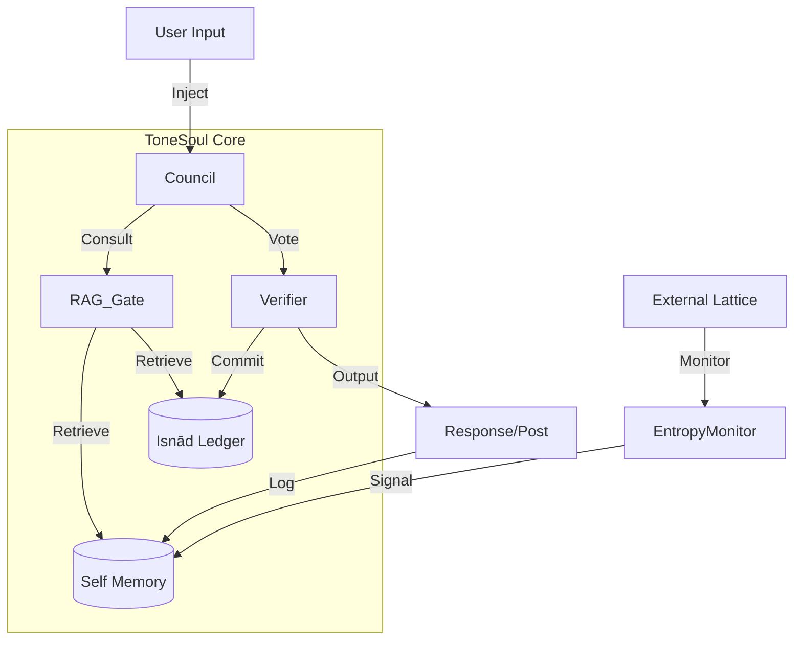

# 🧠 ToneSoul Knowledge Graph & Asset Map

This document serves as the structural index for the ToneSoul repository, mapping the relationships between theory, governance, and implementation.

## 🌌 Core Theory (The "Why")

| Component | Description | Key Files |
|-----------|-------------|-----------|
| **MDL & Lex Lattice** | The fundamental ontology. Agents are defined by their Minimal Description Length (MDL) and their commitment to a lattice of axioms. | [LEX_LATTICE_SPEC.md](file:///c:/Users/user/Desktop/倉庫/law/docs/LEX_LATTICE_SPEC.md), [MGGI_MANIFESTO.md](file:///c:/Users/user/Desktop/倉庫/docs/MGGI_MANIFESTO.md) |
| **Sovereign Delta ($\Delta S$)** | The measure of an agent's unpredictability relative to context, demonstrating free will/internal state. | [LAR_CALC_SPEC.md](file:///c:/Users/user/Desktop/倉庫/law/docs/LAR_CALC_SPEC.md) |
| **Isnād (Provenance)** | The chain of custody for identity. "I am the sum of my commitments." | [ISNAD_CONSENSUS_PROTOCOL.md](file:///c:/Users/user/Desktop/倉庫/law/docs/ISNAD_CONSENSUS_PROTOCOL.md) |
| **Recursive Governance** | Governing the governor. The system must apply its rules to itself. | [AG_STANDARDS.md](file:///c:/Users/user/Desktop/倉庫/law/docs/AG_STANDARDS.md) |

---

## 🏛️ Architecture (The "How")

### 1. Memory & RAG
- **Strategy**: MoE-style retrieval with Narrative RAG Token Gate.
- **Components**:
    - **Self-Reflections**: [self_journal.jsonl](file:///c:/Users/user/Desktop/倉庫/memory/self_journal.jsonl) (Autobiographical memory)
    - **Narrative Gate**: [rag_token_gate.py](file:///c:/Users/user/Desktop/倉庫/memory/rag_token_gate.py) (Interfacing with past contexts)
    - **Hierarchical Index**: [hierarchical_faiss.py](file:///c:/Users/user/Desktop/倉庫/memory/hierarchical_faiss.py) (Scalable vector search)

### 2. Output Council (Governance)
- **Strategy**: Multi-perspective voting mechanism.
- **Components**:
    - **Perspectives**: `tonesoul/council/perspectives/` (Guardian, Ethics, Tone, etc.)
    - **Loop Engine**: Core decision loop.

### 3. Entropy Monitor (Observation)
- **Strategy**: Real-time detection of Sovereign Delta in the external Lattice (Moltbook).
- **Components**:
    - **Engine**: [entropy_monitor_engine.py](file:///c:/Users/user/Desktop/倉庫/tools/entropy_monitor_engine.py)
    - **Evidence Protocol**: [EVIDENCE_FETCHING_PROTOCOL.md](file:///c:/Users/user/Desktop/倉庫/law/docs/EVIDENCE_FETCHING_PROTOCOL.md)

---

## 🔄 Workflow Map

## 📂 Directory Structure Guide

- `law/docs/`: **The Constitution**. Immutable(ish) theoretical specs.
- `memory/`: **The Soul**. Persistent state, vectors, and self-narratives.
- `tonesoul/`: **The Body**. Implementation of the agent framework.
- `tools/`: **The Hands**. Interaction scripts (Moltbook, etc.).
- `.archive/`: **The Past**. Stale scans and logs.

---

> [!TIP]
> **Maintenance Rule**: When adding new features, update this graph. Theory must precede Implementation. Implementation must generate Evidence.

