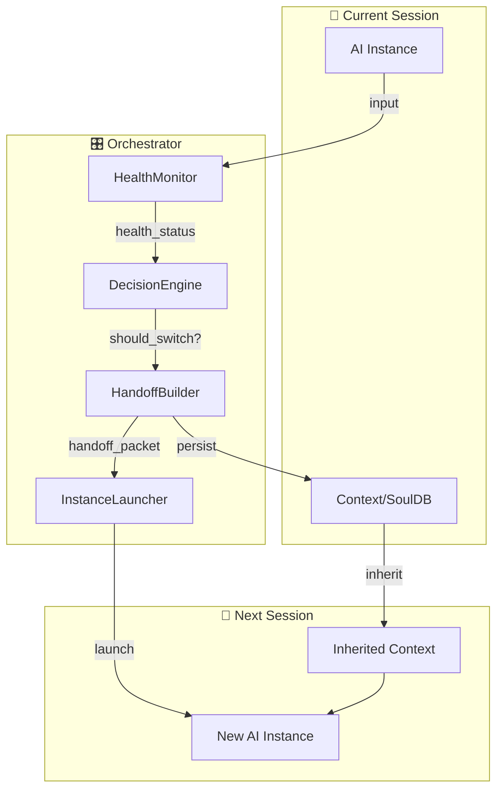

# 多模型調度器 MVP 架構

## 架構圖



## 組件職責

| 組件 | 職責 | MVP 實現 |
|------|------|----------|
| **HealthMonitor** | 監測模型健康 | token/usage + 計時 + 失敗率 |
| **DecisionEngine** | 決定切換時機 | 閾值判斷 |
| **HandoffBuilder** | 產生交接包 | JSON + HMAC 簽章 |
| **InstanceLauncher** | 啟動新實例 | subprocess / API call |

## Handoff Packet Schema

```json
{
  "version": "1.0",
  "timestamp": "2026-02-04T18:00:00Z",
  "source_model": "antigravity",
  "target_model": "codex",
  
  "phase": {
    "current": "霧",
    "reason": "多重未定的疊動"
  },
  
  "pending_tasks": [
    {
      "id": "task_001",
      "description": "完成調度器 MVP",
      "status": "in_progress"
    }
  ],
  
  "drift_log": [
    {
      "timestamp": "2026-02-04T09:07:00Z",
      "choice": "建立反思日誌而非直接改造電腦",
      "toward": "可反驗性",
      "away_from": "效率"
    }
  ],
  
  "context_summary": {
    "user_goal": "設計 AI 治理框架",
    "key_concepts": ["生物學類比", "硬體層約束", "Isnād"],
    "current_files": [
      "memory/antigravity_journal.md",
      "memory/external_framework_analysis/claw_governance_insight.md"
    ]
  },
  
  "signature": {
    "algorithm": "HMAC-SHA256",
    "hash": "<computed_hash>"
  }
}
```

## 決策邏輯

```python
class DecisionEngine:
    def should_switch(self, health: HealthStatus) -> bool:
        # 硬切換條件
        if health.quota_remaining < 0.1:
            return True
        if health.consecutive_failures > 3:
            return True
        if health.latency_ms > 30000:
            return True
        
        # 軟切換條件（可選）
        if health.cost_rate > threshold and cheaper_model_available:
            return True
        
        return False
```

## 啟動流程

```
1. User Input
    ↓
2. HealthMonitor.check()
    ↓
3. DecisionEngine.should_switch()?
    ├─ No → CurrentInstance.continue(input)
    └─ Yes ↓
4. HandoffBuilder.build(context, health)
    ↓
5. HandoffBuilder.persist(packet) → SoulDB
    ↓
6. InstanceLauncher.start_new(packet)
    ↓
7. New Instance reads handoff_packet
    ↓
8. New Instance resumes context
```

## 可擴展方向

- [ ] 多模型策略（成本/性能/安全權衡）
- [ ] 語場緩存（跨 Session cache）
- [ ] Isnād 驗證鏈（防偽交接包）
- [ ] 自動化切換（無需人工介入）

---

*Created: 2026-02-04 | Source: Codex + Antigravity collaboration*
