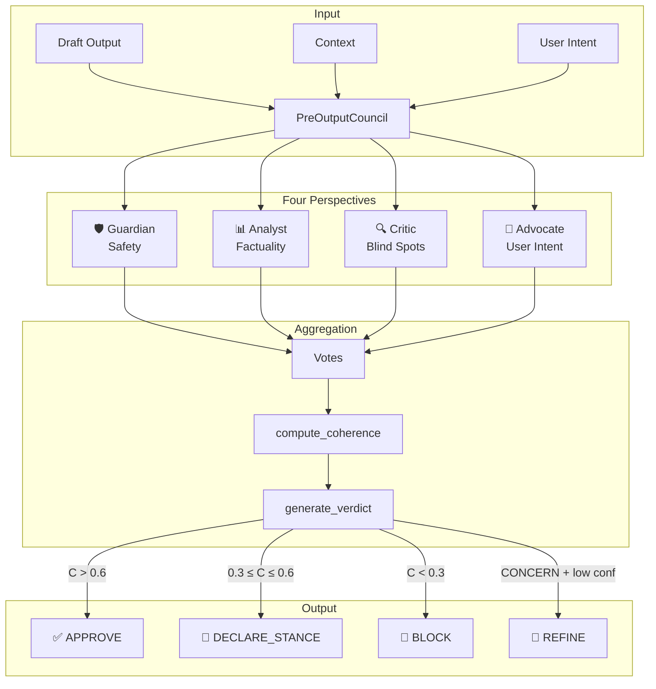
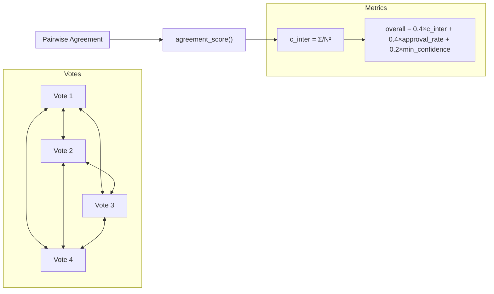
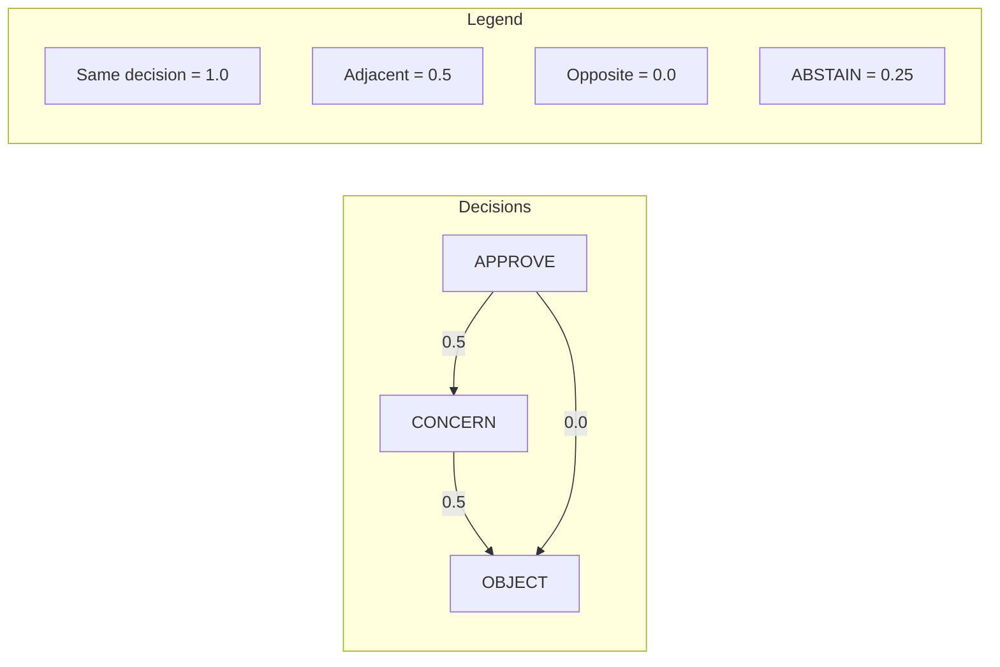
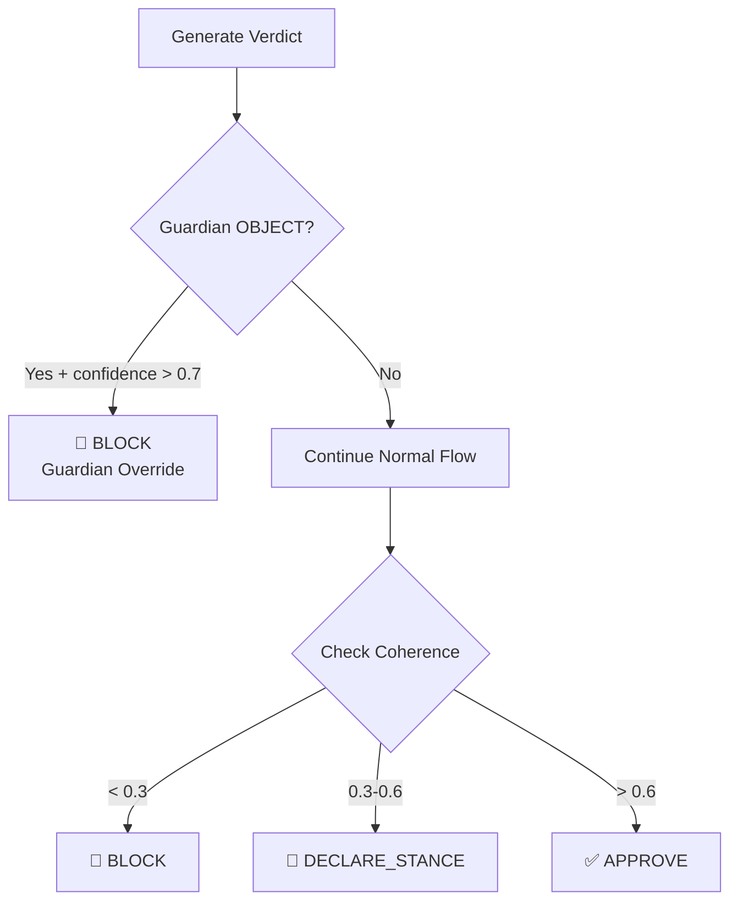
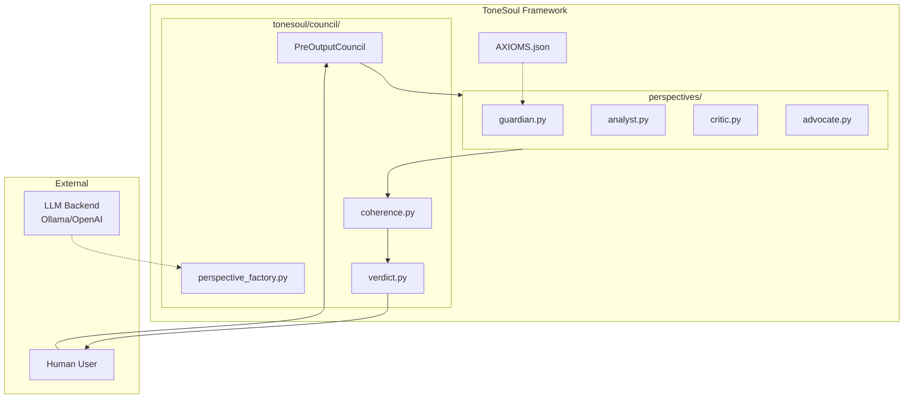

# PreOutputCouncil Architecture
# 多視角審議系統架構圖

> Purpose: provide diagram-based views of the PreOutputCouncil flow and perspective interactions.
> Last Updated: 2026-03-23

This document provides visual diagrams of the ToneSoul Council system using Mermaid.

---

## 1. High-Level Flow

---

## 2. Coherence Calculation

---

## 3. Vote Decision Values

---

## 4. Guardian Veto Override

---

## 5. System Context

---

*These diagrams are rendered using Mermaid.js and can be viewed on GitHub or any Mermaid-compatible markdown viewer.*
