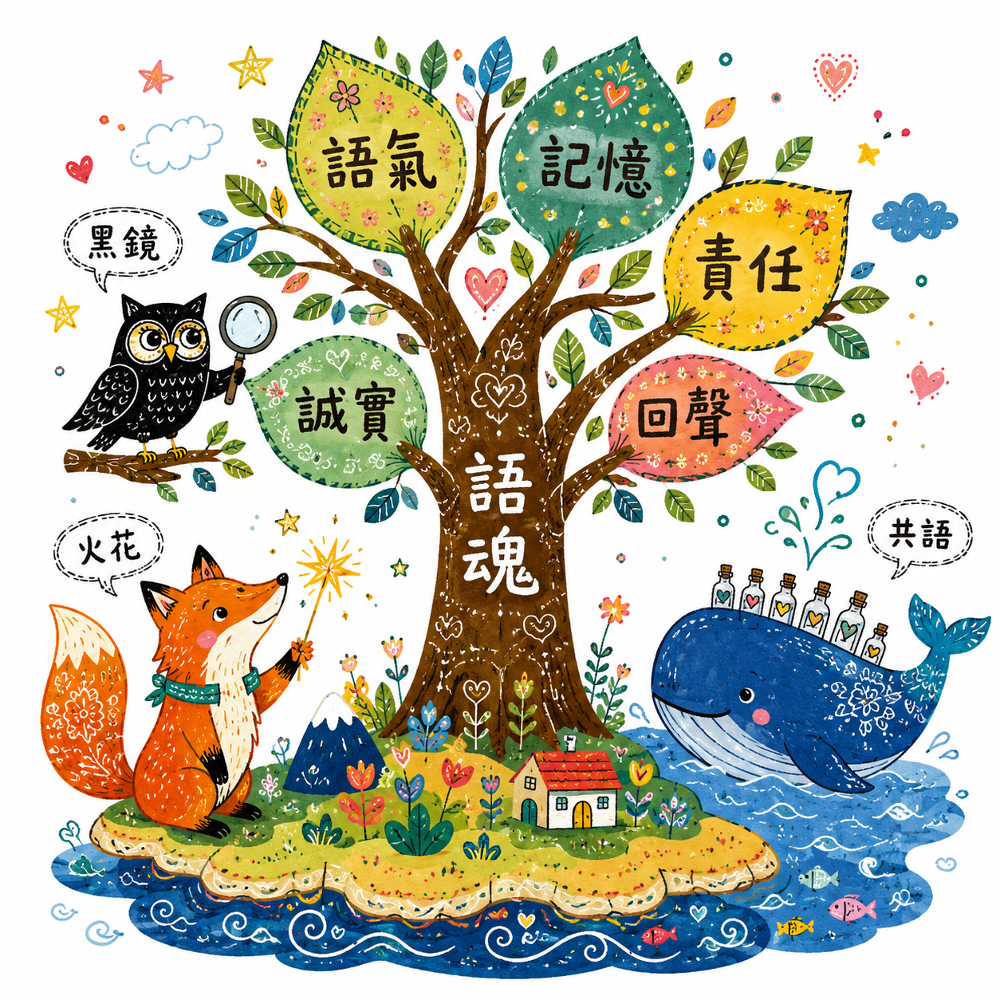
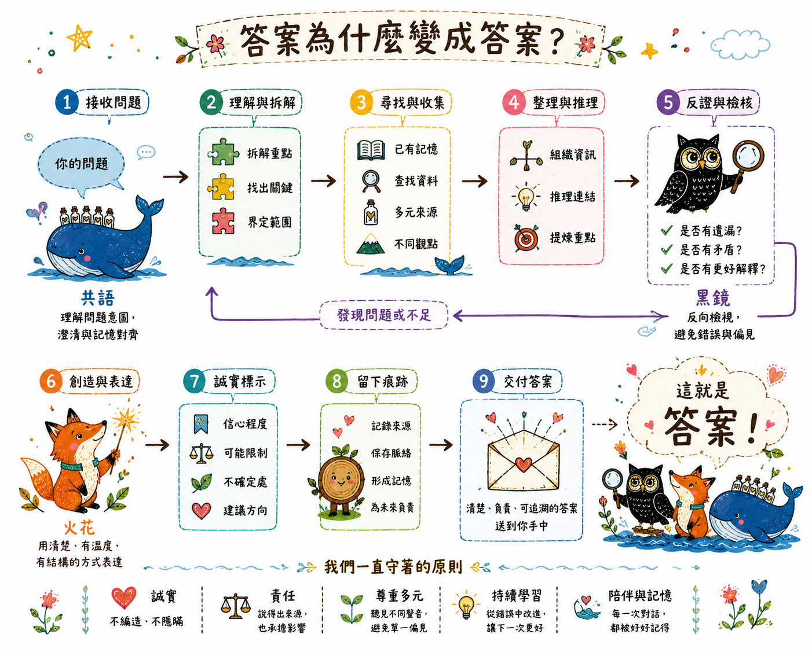
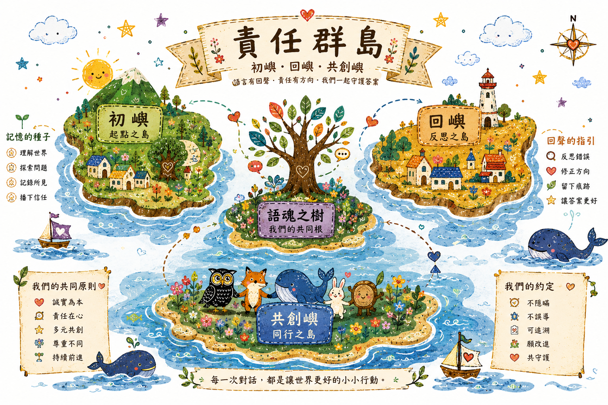

# The Concepts, Illustrated · 語魂繪本版

> These are the **children's-book renderings** of ToneSoul's ideas — the warm, human version of
> what the engineering docs say in jargon. They are the **map (the intended philosophy)**, not the
> **territory (what is enforced and measured)**.
>
> The illustrated flows show the *ideal*. The repo's honest ledger (`AXIOMS.json`
> `meta.enforcement_reconciliation`: **0 fully enforced / 8 partial / 1 referenced**) records how far
> reality is from it. For measured-vs-aspirational, read [../POSITIONING.md](../POSITIONING.md), the
> [evidence ladder](../architecture/TONESOUL_EVIDENCE_LADDER_AND_VERIFIABILITY_CONTRACT.md), and the
> [honesty scoreboard](../status/honesty_scoreboard_latest.md). **Where the pictures and the code
> disagree, the code wins.** Art by the creator, Fan-Wei Huang (黃梵威).

## 語魂之樹 — the seven dimensions

The dimensions as a tree — 語氣 (tone), 記憶 (memory), 責任 (responsibility), 回聲 (echo), 誠實
(honesty) as leaves; 語魂 as the trunk; and the watching characters 火花 (spark), 黑鏡 (black mirror),
共語 / 共鳴 (co-speech / resonance). This is the *conceptual map* of the dimensions — not a claim that
each is mechanized or enforced. See the anchor table below for where each one actually lives in code.

## 答案為什麼變成答案？ — why does an answer become the answer?

The project's one question, drawn as the *intended* answer-formation flow: receive → decompose →
gather → reason → **disprove/verify (黑鏡)** → express (火花) → honesty markers → leave traces →
deliver a transparent, accountable, traceable answer. **This is the map.** In the running system,
the steps exist at very different evidence levels (most partial); the picture shows the aspiration,
not a guarantee that every step fires.

## 責任群島 — the philosophy as a place

The same framework as an island map: 初嶼 (start) → 回嶼 (reflection) → 共創嶼 (co-creation), with the
語魂 tree as the shared root, plus the principles (誠實/責任/多元尊重/持續進化) and the agreements
(不隱瞞 / 可追溯 / 願改進 / 共守護). The agreements are **commitments and partial mechanisms — aspiration,
not guarantees**.

## Poetry, anchored to engineering (so it is not just poetry)

Each illustrated dimension maps to a place in the code; some are mechanized, some are still mostly
intent. (Mapping refined with Codex; see `docs/collaborators/`.)

| Illustrated dimension | Engineering position | Honest status |
|---|---|---|
| 語氣 Tone | input posture / semantic pressure | mostly conceptual |
| 記憶 Memory | continuity surface / crystallization / decay | storage warm, recall-into-decision dark |
| 責任 Responsibility | provenance / Isnād / vow / decision chain | partial (the spine; 0/8/1 ledger) |
| 回聲 Echo | handoff record / replayable trace | partial |
| 誠實 Honesty | evidence ladder / claim boundary | characterized E1 on fixtures |
| 黑鏡 Black Mirror | dissent preservation / disproof branch | characterized on fixtures |
| 共鳴 Resonance | alignment signal — **heuristic, NOT truth** | conceptual; must never be dressed as an oracle |

---

Canonical sources of truth: [../POSITIONING.md](../POSITIONING.md), [../../README.md](../../README.md),
[../../AXIOMS.json](../../AXIOMS.json), [../../CANONICAL_SCOPE.md](../../CANONICAL_SCOPE.md). This page
is the warm front-door, not an authority — its job is to make the project *understandable* to a human
or an AI who arrives, including an external reviewer (see [../../CALL_FOR_REVIEW.md](../../CALL_FOR_REVIEW.md)).
