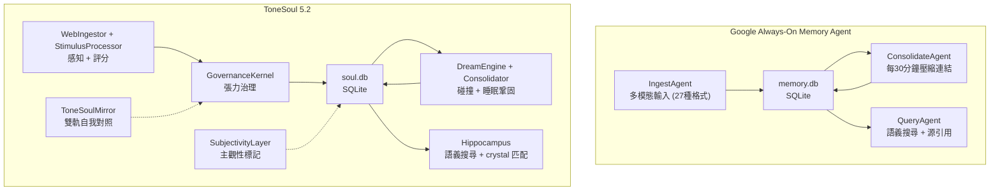

# Always-On Memory Agent (Google) vs ToneSoul — 架構對照

> Purpose: compare Google's always-on memory agent with ToneSoul's governance-first memory architecture.
> Last Updated: 2026-03-23

> **Google Always-On Memory Agent**: [GoogleCloudPlatform/generative-ai](https://github.com/GoogleCloudPlatform/generative-ai/tree/main/gemini/agents/always-on-memory-agent)
> Built with Google ADK + Gemini 3.1 Flash-Lite + SQLite
>
> **ToneSoul 5.2**: [Fan1234-1/tonesoul52](https://github.com/Fan1234-1/tonesoul52)
> Built with GovernanceKernel + Ollama/Gemini + SQLite

---

## 為什麼這個對照重要

Google 官方在 2026 年推出的 Always-On Memory Agent 證明了一件事：
**ToneSoul 在 2025 年底就已經走在這條路上。**

兩個系統解決同一個核心問題：**讓 AI 擁有持續性記憶，而不是每次對話都失憶。**  
但 ToneSoul 在這之上加了一層 Google 沒有做的東西——**治理**。

---

## 架構一對一對照

## 逐模組對照

| 功能 | Google Always-On | ToneSoul | 誰更完整 |
|------|-----------------|----------|---------|
| **感知輸入** | File watcher (27 格式) + HTTP API | WebIngestor (Crawl4AI) + HTTP API | Google ✦ 多模態 |
| **記憶儲存** | `memory.db` (SQLite) | `soul.db` (SQLite) | 相同 |
| **記憶壓縮** | ConsolidateAgent（找連結、壓縮） | sleep_consolidate + DreamEngine（碰撞、結晶） | ToneSoul ✦ 做夢創造新連結 |
| **記憶查詢** | QueryAgent + 源引用 | Hippocampus + crystal rule 匹配 | 相當 |
| **背景執行** | 常駐 (aiohttp server) | 排程 (AutonomousSchedule + wakeup_loop) | 相當 |
| **模型選擇** | Gemini 3.1 Flash-Lite（便宜快速） | Ollama qwen3.5:4b / Gemini（本地+雲端） | ToneSoul ✦ 可離線 |
| **UI** | Streamlit dashboard | dream_observability HTML | Google ✦ 更完整 |
| **記憶寫入治理** | ❌ 無 | ✅ MemoryWriteGateway + promotion gate | **ToneSoul 獨有** |
| **主觀性標記** | ❌ 無 | ✅ SubjectivityLayer (event→identity) | **ToneSoul 獨有** |
| **張力計算** | ❌ 無 | ✅ TensionEngine + friction 閾值 | **ToneSoul 獨有** |
| **做夢引擎** | ❌ 無（只壓縮） | ✅ DreamEngine 碰撞產生建構式記憶 | **ToneSoul 獨有** |
| **自我對照** | ❌ 無 | ✅ ToneSoulMirror (Phase 140) | **ToneSoul 獨有** |
| **價值觀篩選** | ❌ 無 | ✅ RFC-005 三公理 | **ToneSoul 獨有** |

## ToneSoul 可以借鏡的

1. **多模態感知** — Google 支援 27 種格式（圖片、音訊、影片、PDF）。ToneSoul 目前只處理文字。未來 `StimulusProcessor` 可以擴展。

2. **File watcher 模式** — drop file to `./inbox/` 自動 ingest。ToneSoul 可以在 `wakeup_loop` 中加入本地檔案監聽。

3. **Streamlit dashboard** — Google 用 Streamlit 做了記憶瀏覽/刪除/查詢 UI。ToneSoul 的 `dream_observability` 目前只生成靜態 HTML。

## 真正能省時間的地方

不是整套照搬，而是直接縮短 ToneSoul 下一步的設計判斷。

### 現在就能借的

1. **把 retrieval 當成獨立 seam，而不是直接改主 runtime**  
   Google 把 `ingest / consolidate / query` 拆得很乾淨。這讓 ToneSoul 現在的 `Step 3: Retrieval Shadow Mode` 更清楚：先做 read-only 的 shadow query / operator report，不先改 `UnifiedPipeline` 的 live recall。

2. **先做 operator-facing query surface，再談正式 API**  
   Google 的 memory agent 有清楚的查詢入口與 dashboard。ToneSoul 現在也應該先把 `subjectivity-aware` 查詢做成 script / artifact / report seam，等 evidence 夠了再決定要不要進 HTTP/API。

3. **SQLite 先撐住，等 query pressure 再升級 schema**  
   Google 用單一 SQLite `memory.db` 先跑通完整循環。這強化了 ToneSoul 目前的判斷：`SoulDB` 不需要因為 subjectivity 才剛出現就急著 widening；先觀測 shadow-mode query 壓力。

### 可以晚一點借的

1. **多模態 ingest**  
   這是能力擴張，不是現在 subjectivity/retrieval 的 blocker。

2. **檔案投遞式 always-on ingest**  
   可以成為 `wakeup_loop` 的外圍 producer，但不是 reviewed-promotion 或 retrieval shadow mode 的前置條件。

3. **互動式 dashboard**  
   對 operator 會有幫助，但在 subjectivity semantics 還沒穩定前，CLI + status artifact 比較不會過早鎖死呈現方式。

## ToneSoul 不應該向 Google 靠攏的

| Google 做法 | ToneSoul 不應該跟的理由 |
|------------|----------------------|
| 無治理直接寫入 | WriteGateway + promotion gate 是護城河 |
| 純統計壓縮 | DreamEngine 的碰撞式壓縮產生新意義 |
| 無主觀性區分 | SubjectivityLayer 讓記憶有深度 |
| 雲端依賴 | ToneSoul 的本地 Ollama 可離線運行 |

## 對當前計畫的直接影響

這份對照對現在 branch 最有價值的，不是證明 ToneSoul 比 Google 多了什麼，而是幫忙收斂下一步：

1. `Step 3: Retrieval Shadow Mode` 應該先做成 **read-only shadow query seam**。  
   也就是觀測「一般 recall」與「subjectivity-aware recall 候選」之間的差，而不是直接改 live rerank。

2. `Step 4: Conditional Persistence Upgrade` 應該維持條件式。  
   先讓 query/report seam 產生真實 pressure，再決定是否為 `subjectivity_layer` 做 index 或 column。

3. 不能因為看到高度重疊，就把 ToneSoul 的治理拿掉。  
   Google 證明了 always-on memory agent 值得做；它沒有證明 ungoverned memory 足夠做 ToneSoul。

## 結論

> **Google 證明了 always-on memory agent 是正確的方向。**
> **ToneSoul 證明了 memory alone is not enough — governance matters。**
>
> Google 的 agent 是一個很好的 **second brain**（第二大腦）。
> ToneSoul 是一個 **conscious brain**（有意識的大腦）。
>
> 差別在於：Google 幫你記住所有東西。
> ToneSoul 幫你決定什麼值得記住──然後在夢裡，把不相關的碎片碰撞出新的意義。
