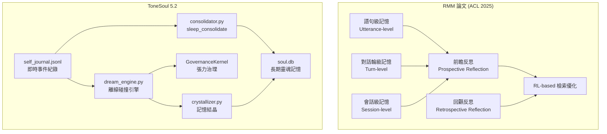

# RMM 論文 vs ToneSoul 記憶架構 — 技術對照

> Purpose: compare the ACL 2025 RMM approach with ToneSoul's memory-governance architecture.
> Last Updated: 2026-03-23

> **RMM**: "In Prospect and Retrospect: Reflective Memory Management for Long-term Personalized Dialogue Agents"
> Zhen Tan et al., **ACL 2025** (同儕審查通過)
>
> **ToneSoul**: ToneSoul 5.2 記憶子系統（Fan1234-1/tonesoul52）

---

## 架構總覽對照



---

## 逐層對照

### 第一層：即時記憶（語句/事件級）

| 維度 | RMM | ToneSoul | 差異分析 |
|------|-----|----------|----------|
| **儲存格式** | 對話語句 (utterance) | [self_journal.jsonl](../../memory/) 事件紀錄 | RMM 只記「說了什麼」；ToneSoul 還記**張力值、gate_decision、contradiction 標記** |
| **粒度** | 固定（每句話一筆） | 語義事件級（一次決策一筆，含 tension/friction 數據） | ToneSoul 的粒度更粗但**更有語義密度** |
| **觸發寫入** | 每輪對話自動寫入 | pipeline 每次決策時寫入 | 相似 |

### 第二層：壓縮記憶（對話輪/合併級）

| 維度 | RMM | ToneSoul | 差異分析 |
|------|-----|----------|----------|
| **壓縮機制** | 前瞻反思 (Prospective Reflection)：按主題分群壓縮 | [sleep_consolidate](../../tonesoul/memory/consolidator.py)：依證據+出處品質閘門篩選後晉升 | ⚠️ **核心差異**。RMM 是「統計壓縮」，ToneSoul 是「公理篩選」|
| **壓縮頻率** | 對話中即時壓縮 | 離線批次 (nightly "AI 睡眠") | RMM 更即時；ToneSoul 特意延遲以模擬「睡眠鞏固」 |
| **篩選標準** | 語義相似度 + 主題聚類 | 三公理 (RFC-005)：共振、承諾、未來約束力 | ToneSoul 的篩選帶有**價值判斷**，不只是資訊論的壓縮 |
| **晉升閘門** | 無（統計閾值） | [_promotion_gate](../../tonesoul/memory/consolidator.py)：要求有證據 + 出處才能晉升 | ToneSoul 防止「幻覺記憶」汙染長期記憶 |

### 第三層：長期記憶（會話/靈魂級）

| 維度 | RMM | ToneSoul | 差異分析 |
|------|-----|----------|----------|
| **儲存** | 向量資料庫 (embedding) | [soul.db](../../memory/) (SQLite) + 向量索引 | ToneSoul 用結構化 DB + 向量雙軌 |
| **檢索** | RL 強化學習優化檢索 | 語義搜尋 + crystal rule 匹配 | RMM 的 RL 檢索在這層**更先進** |
| **記憶品質** | 純資訊保留 | [MemoryCrystallizer](../../tonesoul/memory/)：記憶結晶成「核心規則」 | ToneSoul 會把記憶**蒸餾成行為規則**，RMM 不做這一步 |

### 第四層：RMM 沒有、ToneSoul 獨有的

| 模組 | 功能 | RMM 對應 |
|------|------|----------|
| [DreamEngine](../../tonesoul/dream_engine.py) | 離線碰撞引擎 — 讓外部刺激與既有記憶「做夢式撞擊」，產生建構式記憶 | **無對應。RMM 只處理「真實對話」，不做虛構記憶** |
| [GovernanceKernel](../../tonesoul/governance/kernel.py) | 張力/摩擦力治理 — 記憶寫入受 friction 閾值約束 | **無對應。RMM 的記憶管理沒有治理層** |
| [StimulusProcessor](../../tonesoul/perception/stimulus.py) | 環境感知 — 從外部資料生成記憶候選 | **無對應。RMM 只處理對話，不接收外部刺激** |
| [RFC-005 三公理](../rfc-005-memory-consolidator.md) | 共振、承諾、未來約束力 — 記憶淬鍊的價值觀篩選 | **無對應。RMM 是價值中立的** |

---

## 🎯 ToneSoul 可以從 RMM 借鑑的

### 1. 前瞻反思 (Prospective Reflection) → 增強 `consolidator.py`

**RMM 做法：** 壓縮時不只是刪舊的，而是預測「哪些記憶未來可能被用到」，優先保留。

**ToneSoul 現況：** `sleep_consolidate()` 目前用 `_classify_for_promotion` 做靜態分類（factual/experiential/working），沒有預測機制。

**建議改法：**
```python
# consolidator.py — 新增前瞻反思
def _prospective_score(entry: dict, recent_topics: List[str]) -> float:
    """預測這筆記憶在未來對話中被需要的機率"""
    topic_overlap = len(set(entry.get("topics", [])) & set(recent_topics))
    recency_weight = _time_decay(entry.get("timestamp"))
    tension_signal = entry.get("tension", 0)  # 高張力 = 高重要性
    return (topic_overlap * 0.4) + (recency_weight * 0.3) + (tension_signal * 0.3)
```

> [!IMPORTANT]
> ToneSoul 版的前瞻反思不應只用語義重疊（像 RMM），還要加入**張力信號**。高張力的記憶即使主題不重疊，也應該被優先保留 — 因為它們代表未解決的衝突。

### 2. 回顧反思 (Retrospective Reflection) → 增強 `DreamEngine`

**RMM 做法：** 用 RL 根據「LLM 實際引用了哪些記憶」來回頭調整檢索權重。

**ToneSoul 現況：** `_recall_related_memories()` 用語義搜尋，但沒有回饋機制來學習「哪些記憶真的有被用到」。

**建議改法：**
在 Dream Engine 的 `_build_collision` 完成後，記錄「哪些 `related_memories` 真的影響了 `reflection` 的生成」，回寫一個 `usage_count` 到 soul.db。被頻繁引用的記憶提高檢索優先級，長期未被引用的降級。

### 3. 多粒度記憶表示 → 已有但可強化

**RMM 做法：** utterance → turn → session 三層粒度。

**ToneSoul 現況：** 已有 journal (事件級) → consolidator (壓縮級) → soul.db (長期級)，但中間層的壓縮比較「全有或全無」。

**建議改法：**
在 `identify_patterns()` 裡加入「主題聚類」— 把相關事件聚成主題群組，而不是一筆一筆獨立處理。這樣壓縮後的記憶會有更好的語義結構。

---

## 🔥 ToneSoul 不應該從 RMM 借鑑的

| RMM 做法 | 為什麼 ToneSoul 不該跟 | 理由 |
|----------|----------------------|------|
| 純統計壓縮 | ToneSoul 的三公理篩選更有深度 | 放棄公理 = 放棄護城河 |
| 即時壓縮 | ToneSoul 的「睡眠鞏固」設計是刻意的 | 延遲壓縮讓 Dream Engine 有機會「做夢」 |
| 價值中立 | ToneSoul 的記憶帶有價值判斷 | 這是 ToneSoul 跟所有其他框架最大的差異 |
| RL 訓練檢索 | 需要大量互動數據 | ToneSoul 目前的互動量不足以訓練 RL 模型 |

---

## 總結：RMM 是工程、ToneSoul 是哲學

RMM 回答的問題是：**「怎麼讓 AI 記住更多、忘掉更少？」** — 這是一個工程問題。

ToneSoul 回答的問題是：**「AI 應該記住什麼、忘掉什麼、以及為什麼？」** — 這是一個哲學問題。

RMM 的三層記憶是**資訊論驅動的**：按語義相似度壓縮、按 RL 回饋優化檢索。
ToneSoul 的三層記憶是**價值觀驅動的**：按三公理篩選、按張力決定保留、用做夢創造新記憶。

兩者**不衝突**。RMM 的工程手段可以成為 ToneSoul 哲學框架下的「執行工具」— 用 RMM 的前瞻反思來**預測**哪些記憶重要，但最終決定用三公理來**裁決**。
