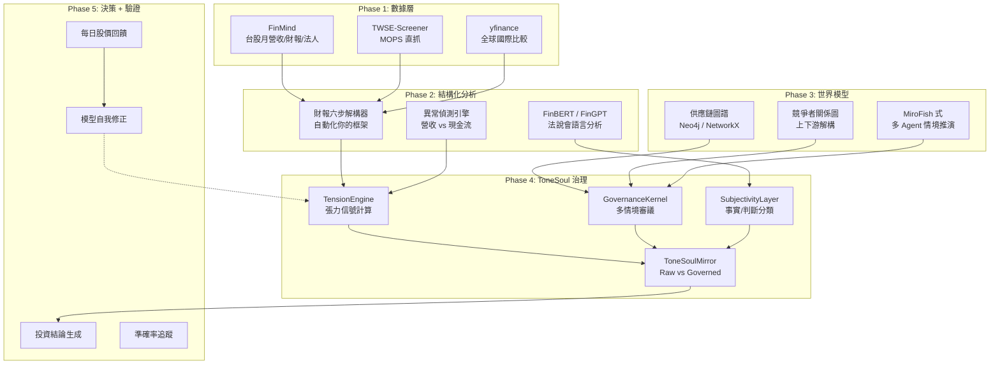

# ToneSoul Market Mirror — 投資分析子系統完整計畫

**提案者**: Antigravity (Architect)
**日期**: 2026-03-10

---

## 為什麼要做這個

ToneSoul 的治理框架跟投資分析不是「可以借用」，是**同一套邏輯**：

| ToneSoul 治理 | 投資分析 | 共用模組 |
|-------------|---------|---------|
| 事件感知 | 財報數據抓取 | `StimulusProcessor` |
| 張力計算 | 異常信號偵測 | `TensionEngine` |
| 治理審議 | 多情境推演 | `GovernanceKernel` |
| 記憶壓縮 | 時間序列趨勢 | `Consolidator` |
| 主觀性標記 | 事實 vs 判斷分離 | `SubjectivityLayer` |
| 鏡子對照 | Raw vs Governed 結論 | `ToneSoulMirror` |
| 做夢引擎 | 碰撞產生新洞察 | `DreamEngine` |

**這不是另一個產品。這是 ToneSoul 治理框架的應用場域驗證。**

做投資分析的好處：
1. 每天都有股價驗證 → 治理框架的 **accuracy feedback loop**
2. 財報是結構化數據 → 最適合壓力測試 TensionEngine
3. 公司關係是圖結構 → 驗證 DreamEngine 的碰撞邏輯
4. 長期來看，AI 消滅短線套利 → **只剩 long-term 分析有價值 → 這正是 ToneSoul 擅長的**

---

## 完整架構



---

## Phase 1: 數據層（Data Ingestion）

### 目的
把公開可審計的財務數據，自動餵入 ToneSoul 的 `StimulusProcessor`。

### 工具選擇

| 工具 | 用途 | 為什麼選它 |
|------|------|-----------|
| **[FinMind](https://github.com/FinMind/FinMind)** | 台股專用：50+ 資料集（月營收、損益表、資產負債表、現金流、法人買賣超、融資融券、股利） | 台股最完整的 Python 資料來源，直接從 TWSE/MOPS 抓取 |
| **[TWStock-Screener](https://github.com/ch-lai/TWStock-Screener)** | MOPS 月營收 + 季度財報直抓 | 備用方案，可客製篩選條件 |
| **[yfinance](https://github.com/ranaroussi/yfinance)** | 全球股票 OHLCV + 基本面 | 做國際同業比較用 |

### 接法

```python
# tonesoul/market/data_ingest.py
class MarketDataIngestor:
    """把財報數據轉成 ToneSoul EnvironmentStimulus"""
    
    def fetch_quarterly(self, stock_id: str) -> List[EnvironmentStimulus]:
        """從 FinMind 抓季報，轉成 stimulus"""
        
    def fetch_monthly_revenue(self, stock_id: str) -> List[EnvironmentStimulus]:
        """從 FinMind 抓月營收，轉成 stimulus"""
        
    def fetch_institutional(self, stock_id: str) -> List[EnvironmentStimulus]:
        """法人買賣超、融資融券"""
```

---

## Phase 2: 結構化分析（六步框架自動化）

### 目的
把你的六步財報分析框架寫成程式，自動產出結構化分析。

### 工具選擇

| 工具 | 用途 | 為什麼選它 |
|------|------|-----------|
| **[FinGPT](https://github.com/AI4Finance-Foundation/FinGPT)** (14k⭐) | LLM 驅動的財報分析 + FinGPT-Forecaster 股價預測 | AI4Finance 基金會維護，學術等級 |
| **[FinBERT](https://github.com/ProsusAI/finBERT)** | 金融文本情緒分析（法說會/新聞） | 專門為金融語言微調的 BERT |
| **[IRGraph](https://github.com/...)** | 法說會逐字稿 → 知識圖譜 + 股價關聯 | 打通 Step 5（管理層語言分析） |

### 六步自動化對應

```python
# tonesoul/market/analyzer.py
class SixStepAnalyzer:
    """你的六步財報分析框架的程式化版本"""
    
    def step1_structure(self, data) -> CompanyStructure:
        """業務結構、收入來源、毛利率驅動"""
        
    def step2_anomaly(self, data) -> List[TensionSignal]:
        """異常信號：營收↑現金流↓、利潤↑庫存↑"""
        # → 直接輸出到 TensionEngine
        
    def step3_business_model(self, data) -> BusinessModel:
        """反向重建商業模型"""
        # → 用 DreamEngine 碰撞產生洞察
        
    def step4_time_series(self, data) -> TrendAnalysis:
        """多季/多年趨勢分析"""
        # → 用 Consolidator 做模式識別
        
    def step5_mgmt_language(self, transcript) -> SentimentReport:
        """管理層語言分析（用 FinBERT）"""
        # → 輸出到 SubjectivityLayer
        
    def step6_scenarios(self, model, trends) -> InvestmentScenarios:
        """Bull/Base/Bear 情境建構"""
        # → 用 GovernanceKernel 做多情境審議
```

---

## Phase 3: 世界模型（公司關係圖 + 情境模擬）

### 目的
把公司不只當單一實體分析，而是放在供應鏈和競爭環境裡推演。

### 工具選擇

| 工具 | 用途 | 為什麼選它 |
|------|------|-----------|
| **NetworkX** | Python 原生圖結構分析 | 輕量、不需額外 DB |
| **Neo4j**（未來） | 大規模知識圖譜 | 等圖譜規模到千家公司再考慮 |
| **[MiroFish](https://github.com/666ghj/MiroFish)** | 群體智能仿真 | 你找到的，多 Agent 模擬推演 |
| **[CAMEL-AI](https://github.com/camel-ai/camel)** | 多 Agent 角色扮演 | 模擬 Buffett vs Lynch vs Dalio 的觀點 |

### 整合重點

```python
# tonesoul/market/world_model.py
class CompanyGraph:
    """公司關係圖譜"""
    
    def add_supply_chain(self, company, suppliers, customers):
        """上下游關係"""
        
    def add_competitors(self, company, competitors):
        """競爭者關係"""
        
    def stress_test(self, scenario: str) -> ImpactReport:
        """情境壓力測試：如果 DRAM 跌 30%，影響哪些節點？"""
        # → 用 TensionEngine 計算傳導張力

class MultiPerspectiveSimulator:
    """多觀點投資模擬"""
    
    def simulate(self, company_data, perspectives: List[str]) -> Dict:
        """
        perspectives = ['value_investor', 'growth_investor',
                       'momentum_trader', 'risk_manager', 'tonesoul_governance']
        每個觀點用不同的 prompt/模型跑分析，最後 GovernanceKernel 做審議
        """
```

---

## Phase 4: ToneSoul 治理層整合

### 現有模組直接使用

| 模組 | 投資分析用途 | 修改量 |
|------|------------|--------|
| `TensionEngine` | 異常信號 → friction score | 加入財報特化的 signal 定義 |
| `GovernanceKernel` | 多情境審議 → approve/deny/conditions | 加入投資決策的 decision schema |
| `SubjectivityLayer` | 標記事實 vs 判斷 | 直接使用 |
| `ToneSoulMirror` | Raw 結論 vs Governed 結論 | Phase 140 完成後直接使用 |
| `WriteGateway` | 分析結果寫入 soul.db | 直接使用 |
| `DreamEngine` | 碰撞產生投資洞察 | 加入財報碰撞的 stimulus 類型 |

### 新增 Schema

```python
# tonesoul/schemas.py 新增
class InvestmentVerdict(BaseModel):
    """投資決策治理結果"""
    decision: str  # "buy" | "hold" | "sell" | "watch"
    confidence: float
    friction_score: float
    scenarios: List[InvestmentScenario]
    tension_signals: List[TensionSignal]
    mirror_delta: MirrorDelta
    tracking_variables: List[str]
    stop_loss: Optional[float]
    position_sizing: Optional[str]
```

---

## Phase 5: 每日驗證迴圈（Accuracy Feedback Loop）

### 核心概念

**這是整個系統最獨特的部分。**

投資分析有一個其他 AI 應用沒有的優勢：**每天都有驗證數據（股價）。**

```
第 1 天：ToneSoul 產出分析 → 結論：「看好，目標 1500」
第 2 天：股價 920 (+1.7%)
第 3 天：股價 905 (-1.6%)
...
第 30 天：股價 1100 (+21.5%)
...
第 90 天：股價 1400 (+54.7%)

→ 每天自動比對：
   ToneSoul 的 tension_signals 是否預測了漲跌？
   friction_score 是否與實際波動率相關？
   mirror_delta 有沒有抓到盲點？
```

### 實作

```python
# tonesoul/market/accuracy_tracker.py
class AccuracyTracker:
    """每日股價驗證迴圈"""
    
    def record_prediction(self, stock_id, verdict: InvestmentVerdict):
        """記錄預測"""
        
    def daily_check(self, stock_id) -> AccuracyReport:
        """每日收盤後自動比對"""
        
    def feedback_to_tension(self, report: AccuracyReport):
        """把準確率回饋給 TensionEngine 調整權重"""
        
    def monthly_report(self) -> MonthlyAccuracyReport:
        """月度準確率報告"""
```

### 驗證指標

| 指標 | 計算方式 | 目標 |
|------|---------|------|
| **方向準確率** | 預測漲/跌 vs 實際 | > 55%（勝過隨機） |
| **Tension 有效性** | 高 friction 是否真的伴隨高波動 | 相關係數 > 0.3 |
| **Mirror 價值** | Governed 結論 vs Raw 結論哪個更準 | Governed > Raw |
| **停損有效性** | 停損觸發後，股價是否繼續下跌 | > 60%（停損正確率） |

---

## 你說的「未來大家都用 AI，只剩長期線」

這個觀察決定了架構設計：

```
短線分析（AI 消滅的）           長線分析（ToneSoul 擅長的）
──────────────────           ──────────────────────
技術指標                      商業模型理解
價格動量                      產業趨勢判斷
成交量模式                    供應鏈圖譜
日內波動                      管理層語言變化
                             記憶積累（對同一家公司追蹤半年+）
                             張力演化（tension 的時間序列）
                             做夢碰撞（看似不相關的事件連結）
```

ToneSoul 的記憶系統天生適合長線——它不是每次重新分析，而是**記住上次的分析，在新數據來的時候做差異比對**。

---

## 執行順序

不是完成一個才做下一個。是**邊做邊跑**：

```
月份 1-2：Phase 1（數據層）
  → FinMind 接入 → 自動抓月營收
  → 每天手動驗證

月份 2-3：Phase 2（六步自動化）
  → 前 3 步先做（結構+異常+模型）
  → 開始產出可執行的分析

月份 3-4：Phase 4（治理接入）
  → TensionEngine 計算投資 friction
  → Mirror 對照 raw vs governed

月份 4-6：Phase 5（驗證迴圈）
  → 每日自動比對股價
  → 開始累積準確率數據

月份 6+：Phase 3（世界模型）
  → 供應鏈圖譜
  → 多觀點模擬
  → 這是最難的，但有前面的數據基礎

持續：
  → 每天股價驗證
  → 每月 accuracy report
  → TensionEngine 權重自我調整
```
