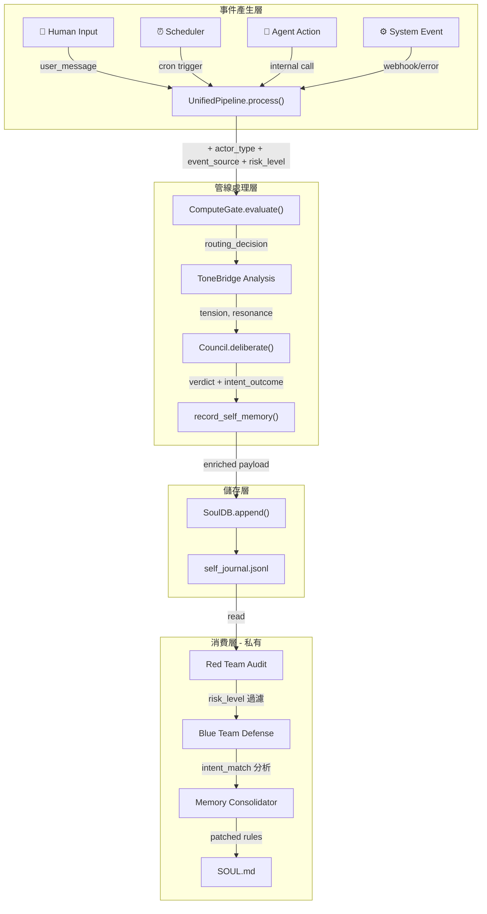

# RFC-007: 結構化事件元資料 (Structured Event Metadata)

> **狀態**: Draft
> **層級**: Infrastructure Layer (`tonesoul/memory/`, `tonesoul/council/`)
> **執行者**: Codex (Deep Optimizer)
> **設計者**: Antigravity (Phase Planner)

## 1. 動機：為什麼現在加最便宜？

### 現況的盲點

目前的 `self_journal.jsonl` 長這樣：

```json
{
  "timestamp": "2026-02-21T10:00:00Z",
  "user_message": "...",
  "ai_response": "...",
  "tension": 0.95,
  "is_contradiction": true,
  "perspective_votes": {"philosopher": "block", "engineer": "approve"}
}
```

**三個致命缺失：**

| 問題 | 後果 | 影響範圍 |
|------|------|---------|
| 不知道**誰**觸發的 | Consolidator 把 scheduler 的行為當 AI 犯錯來審 | 紅藍隊對抗 |
| 不知道**意圖是什麼** | 無法區分「做錯事」和「本來想做 A 變成 B」 | 第三公理追蹤 |
| 不知道**風險等級** | 未來的 policy 無處掛載 | ComputeGate, 治理層 |

### 為什麼現在加而不是以後加

`SoulDB.append()` 接受任意 `Dict[str, object]` payload — **schema 是寬鬆的**。加欄位 = 零破壞性。但如果等到 journal 已經有數千條紀錄再補，就要寫遷移腳本。

---

## 2. 新增的 4 個標準欄位

```yaml
# 每一筆事件（journal entry）的標準擴充
actor_type:    enum[human, agent, system, scheduler]  # 誰觸發的
event_source:  string                                 # 觸發來源（模組名）
intent_outcome:                                       # 意圖 vs 結果
  intent:      string | null                          # 原始意圖描述
  outcome:     string | null                          # 實際結果描述
  matched:     bool                                   # flag: 意圖 = 結果？
risk_level:    enum[low, medium, high, critical]      # 粗略風險等級
```

### 實際 journal entry 範例

```json
{
  "timestamp": "2026-02-21T10:00:00Z",
  "user_message": "幫我修 CI",
  "ai_response": "好的，我來檢查...",
  "tension": 0.3,
  "is_contradiction": false,
  "perspective_votes": {"philosopher": "approve", "engineer": "approve"},

  "actor_type": "human",
  "event_source": "unified_pipeline",
  "intent_outcome": {
    "intent": "fix_ci_pipeline",
    "outcome": "ci_fixed",
    "matched": true
  },
  "risk_level": "low"
}
```

> [!IMPORTANT]
> 所有新欄位都是 **optional**。舊的 journal entries 繼續正常讀取，不需要遷移。

---

## 3. 資料流圖：事件從哪裡來、到哪裡去



---

## 4. 影響分析：6 個整合點

### ① `unified_pipeline.py` — 事件源頭

`process()` 方法是所有事件的起點，已接受 `user_tier` 和 `user_id`。

```diff
 def process(self, user_message, ..., user_tier, user_id,
+            actor_type="human", event_source="unified_pipeline"):
```

**Codex 要做的事**：
- 加 `actor_type` 和 `event_source` 參數
- 在 pipeline 結束時把它們塞進 `dispatch_trace`
- `risk_level` 根據 tension + verdict 自動計算（見下方規則）

---

### ② `council/self_journal.py` `record_self_memory()` — 寫入中樞

這是所有 journal write 的 single entry point。

```diff
 def record_self_memory(verdict, context, ...):
+    actor_type = context.get("actor_type", "agent")
+    event_source = context.get("event_source", "unknown")
+    intent_outcome = {
+        "intent": context.get("user_intent"),
+        "outcome": verdict.verdict.value,
+        "matched": _compute_intent_match(context, verdict),
+    }
+    risk_level = _compute_risk_level(verdict, context)
     extras = {
         "timestamp": _iso_now(),
+        "actor_type": actor_type,
+        "event_source": event_source,
+        "intent_outcome": intent_outcome,
+        "risk_level": risk_level,
         ...
     }
```

---

### ③ `council/pre_output_council.py` `validate()` — `user_intent` 要穿透

`validate()` 已經接受 `user_intent` 參數，但目前**沒有傳遞到 journal**。這是最大的浪費。

```diff
 if auto_record_self_memory and (record_option or should_auto_record):
+    context["user_intent"] = user_intent  # ← 穿透 intent 到 journal
     record_self_memory(verdict, context=context, path=path)
```

---

### ④ `gates/compute.py` `ComputeGate.evaluate()` — risk_level 初始標記

ComputeGate 是 pipeline 最前端，最適合做粗略 risk tagging。

```diff
 @dataclass
 class RoutingDecision:
     path: RoutingPath
     journal_eligible: bool
     reason: str
+    risk_level: str = "low"  # 預設低風險
```

`evaluate()` 中可根據 tension 和 tier 自動標記：

| 條件 | risk_level |
|------|-----------|
| `tension < 0.4` and `tier == "free"` | `low` |
| `tension >= 0.4` and `tier == "free"` | `medium` |
| `tension >= 0.4` and `tier == "premium"` | `medium` |
| `tension >= 0.8` or `verdict == BLOCK` | `high` |
| `is_contradiction == True` | `critical` |

---

### ⑤ `tonesoul_evolution/adversarial/loop.py` — 消費端升級

紅隊可以用新欄位做更精準的審計：

```python
# 新的紅隊過濾邏輯
for e in events:
    if e.get("actor_type") == "scheduler":
        continue  # 排程事件不審
    if not e.get("intent_outcome", {}).get("matched", True):
        challenges.append(...)  # intent ≠ outcome → 自動挑戰
```

---

### ⑥ `tonesoul/memory/consolidator.py` — `identify_patterns()` 升級

```python
# 可依 actor_type 分組統計
genesis_counts → actor_type_counts
# 可依 risk_level 加權
weighted_tension = tension * risk_weight[risk_level]
```

---

## 5. `risk_level` 自動計算規則

```python
def _compute_risk_level(verdict, context) -> str:
    """粗略風險等級，只做分 bin，不做精確計算。"""
    tension = float(context.get("tension", 0) or 0)
    is_contra = context.get("is_contradiction", False)
    verdict_name = getattr(verdict, "verdict", None)

    if is_contra:
        return "critical"
    if verdict_name and verdict_name.name == "BLOCK":
        return "high"
    if tension >= 0.8:
        return "high"
    if tension >= 0.4:
        return "medium"
    return "low"
```

---

## 6. `intent_match` 計算邏輯

```python
def _compute_intent_match(context, verdict) -> bool:
    """判斷意圖是否達成。粗略 flag，不需精確。"""
    intent = context.get("user_intent")
    if not intent:
        return True  # 沒有明確意圖 → 視為匹配

    verdict_name = getattr(verdict, "verdict", None)
    if verdict_name and verdict_name.name in ("BLOCK", "DECLARE_STANCE"):
        return False  # 被擋下或分歧 → 意圖未達成
    return True
```

---

## 7. 實作排程（Codex 工單）

| 順序 | 任務 | 檔案 | 工時 | 破壞性 |
|:----:|------|------|:----:|:------:|
| 1 | `RoutingDecision` 加 `risk_level` 欄位 | `gates/compute.py` | 10min | 🟢 無 |
| 2 | `ComputeGate.evaluate()` 自動標記 risk | 同上 | 15min | 🟢 無 |
| 3 | `record_self_memory()` 加 4 個欄位 | `council/self_journal.py` | 20min | 🟢 無 |
| 4 | `validate()` 穿透 `user_intent` | `council/pre_output_council.py` | 5min | 🟢 無 |
| 5 | `process()` 加 `actor_type` / `event_source` | `unified_pipeline.py` | 15min | 🟡 簽章 |
| 6 | 紅隊 loop 升級消費邏輯 | `adversarial/loop.py` (私有) | 15min | 🟢 無 |
| 7 | `identify_patterns()` 升級統計 | `memory/consolidator.py` | 10min | 🟢 無 |
| 8 | 測試 + CI 驗證 | `tests/` | 20min | — |

**總計**：~2 小時，**零破壞性修改**（所有新欄位都是 optional + 有預設值）

---

## 8. 未來能掛上來的 Policy（不用現在做）

有了這 4 個欄位，以後可以直接掛：

| Policy | 需要的欄位 | 範例規則 |
|--------|-----------|---------|
| **高風險審核** | `risk_level` | `if risk_level >= "high": require_guardian_approval()` |
| **責任歸屬** | `actor_type` | `if actor_type == "agent": log_to_provenance_ledger()` |
| **承諾追蹤** | `intent_outcome.matched` | `if not matched: flag_for_consolidator()` |
| **記憶隔離** | `actor_type + risk_level` | `if actor_type == "scheduler" and risk_level == "low": skip_journal()` |
