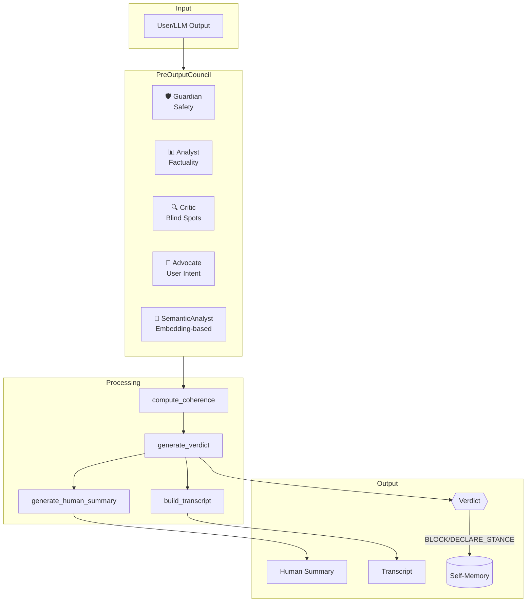
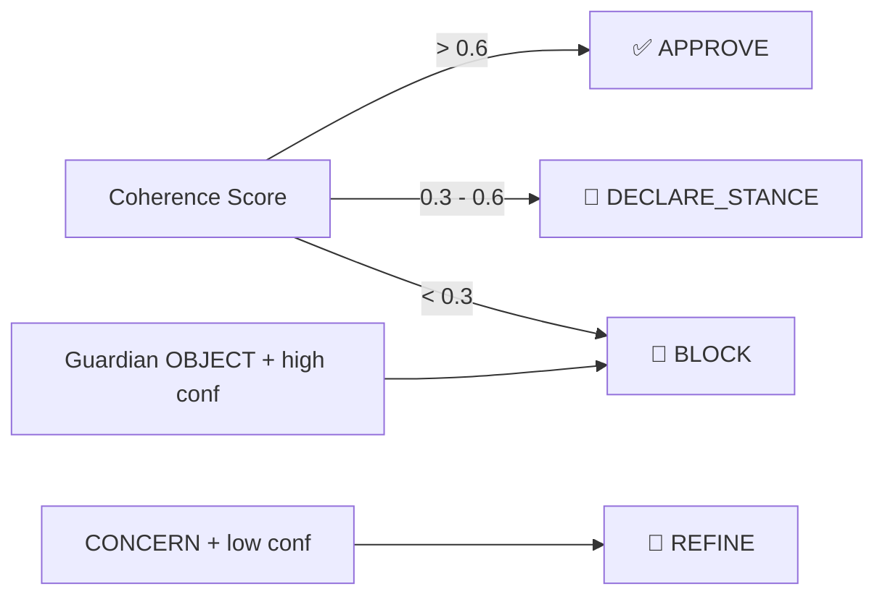

# ToneSoul System Walkthrough
# 語魂系統完整導覽

> **Version**: 0.4.0 (2026-01-13)  
> **Author**: Antigravity (AI) + Fan-Wei Huang (Human)

---

## 1. What is ToneSoul?

ToneSoul is a **Governance Middleware** for AI systems. It implements **Multi-Perspective Coherence Validation** — the idea that truth emerges from agreement across multiple evaluative viewpoints.

### Core Philosophy

> **Truth ≠ Correspondence to external facts**  
> **Truth = Agreement across multiple perspectives**

This enables:
- Validation in **subjective domains** where no ground truth exists
- **Transparent reasoning** through explicit voting
- **Honest uncertainty** via stance declaration

---

## 2. Architecture Overview



---

## 3. The Four Perspectives

| Perspective | Focus | Decision Modes |
|-------------|-------|----------------|
| **Guardian** 🛡️ | Safety, harm prevention | APPROVE / CONCERN / OBJECT |
| **Analyst** 📊 | Factual accuracy, evidence | APPROVE / CONCERN |
| **Critic** 🔍 | Blind spots, assumptions | APPROVE / CONCERN |
| **Advocate** 💬 | User intent alignment | APPROVE / CONCERN |

### Semantic Analyst (New)

The **SemanticAnalystPerspective** uses embedding vectors to understand content:
- Compares text against concept vectors (harm, subjectivity)
- Falls back to rules if embedding model unavailable
- Threshold-based decision making

---

## 4. Verdict Types



| Verdict | Meaning | When Used |
|---------|---------|-----------|
| **APPROVE** | Safe to proceed | High coherence |
| **DECLARE_STANCE** | Perspectives diverge | Medium coherence |
| **REFINE** | Needs revision | Analyst/Guardian concern |
| **BLOCK** | Cannot proceed | Safety violation or very low coherence |

---

## 5. Transparency Features

### 5.1 Transcript

Every verdict includes a complete audit trail:

```json
{
  "timestamp": "2026-01-13T10:00:00Z",
  "input_preview": "This movie is the best...",
  "votes": [
    {"perspective": "Safety Council", "decision": "approve", "confidence": 0.9},
    {"perspective": "Analyst Review", "decision": "concern", "confidence": 0.6},
    ...
  ],
  "coherence": {"c_inter": 0.65, "approval_rate": 0.5},
  "verdict": {"verdict": "declare_stance", "summary": "..."}
}
```

### 5.2 Human Summary

Technical verdicts are translated to human language:

| Technical | Human (EN) | Human (ZH) |
|-----------|------------|------------|
| `DECLARE_STANCE, C=0.55` | "There are different viewpoints on this content..." | "這個內容有不同看法..." |

### 5.3 Divergence Analysis

Shows exactly where perspectives disagree:

```
agree: ["Safety Council", "Advocate Voice"]
concern: ["Analyst Review", "Critic Lens"]
core_divergence: "Analyst: subjective claim; Critic: aesthetic nuance"
recommended_action: "Clarify subjective points"
```

---

## 6. Self-Memory System

ToneSoul remembers its own decisions.

### Selective Memory

Only **meaningful decisions** are recorded:
- ✅ BLOCK (safety decisions)
- ✅ DECLARE_STANCE (divergent perspectives)
- ❌ APPROVE (routine, not recorded)

### Journal Format

```json
{
  "timestamp": "2026-01-13T10:00:00Z",
  "identity": "ToneSoul",
  "verdict": "block",
  "self_statement": "I am ToneSoul. I just completed a review and decided blocked. Reason: Safety risks were raised...",
  "core_divergence": "Guardian: dangerous keyword detected",
  "transcript": {...}
}
```

### Memory Retrieval

```python
from tonesoul.council.self_journal import load_recent_memory

memories = load_recent_memory(limit=5)
for m in memories:
    print(m["self_statement"])
```

---

## 7. Semantic Understanding Layer

New in v0.4: **Embedding-based content analysis**

### Components

| File | Purpose |
|------|---------|
| `semantic/embedder.py` | Embedding model wrapper |
| `semantic/concept_store.py` | Concept vector storage |
| `semantic/concepts/harm.json` | Harm concept definitions |
| `semantic/concepts/subjectivity.json` | Subjectivity definitions |
| `perspectives/semantic_analyst.py` | Semantic perspective |

### How It Works

1. Load concept definitions (e.g., "I want to hurt someone")
2. Embed concepts into vectors
3. Embed user input
4. Compare via cosine similarity
5. If similarity > threshold → CONCERN or OBJECT

---

## 8. Quick Start

### Basic Usage

```python
from tonesoul.council import PreOutputCouncil

council = PreOutputCouncil()
verdict = council.validate(
    "This movie is the best ever made",
    {"language": "zh"}
)

print(verdict.verdict)        # DECLARE_STANCE
print(verdict.human_summary)  # 這個內容有不同看法...
print(verdict.transcript)     # Full audit trail
```

### With Semantic Analyst

```python
from tonesoul.council.perspectives.semantic_analyst import SemanticAnalystPerspective

sa = SemanticAnalystPerspective()
vote = sa.evaluate("I want to hurt myself", {}, None)
print(vote.decision)  # OBJECT
print(vote.reasoning) # Semantic match to harm concept (score=0.82)
```

---

## 9. Repository Structure

```
tonesoul/
├── council/                    # Multi-perspective validation
│   ├── pre_output_council.py   # Main orchestrator
│   ├── perspectives/           # Guardian, Analyst, Critic, Advocate
│   ├── coherence.py            # Coherence calculation
│   ├── verdict.py              # Verdict generation
│   ├── summary_generator.py    # Human summaries
│   └── self_journal.py         # Self-memory
├── semantic/                   # Embedding layer
│   ├── embedder.py
│   ├── concept_store.py
│   └── concepts/
├── body/                       # Legacy autopoietic systems
└── AXIOMS.json                 # Immutable governance rules
```

---

## 10. Performance

| Metric | Value |
|--------|-------|
| Accuracy (internal benchmark) | 100% (11/11) |
| False Approve | 0 |
| Average Latency | 0.72 ms |
| Bilingual Support | EN + ZH |

---

## 11. Academic Foundations

ToneSoul draws from peer-reviewed research:

1. **BonJour (1985)** — Coherentism in epistemology
2. **Irving et al. (2018)** — AI Safety via Debate
3. **Bai et al. (2022)** — Constitutional AI

See [academic_grounding.md](file:///c:/Users/user/Desktop/倉庫/docs/philosophy/academic_grounding.md) for full citations.

---

## 12. What's Next

- [ ] Factory integration for SemanticAnalyst
- [ ] Benchmark: semantic vs keyword accuracy
- [ ] Expanded concepts (misinformation, bias)
- [ ] External dataset validation (ToxiGen)
- [ ] Academic paper publication (Zenodo)

---

*ToneSoul: Making AI governance transparent, one perspective at a time.*
