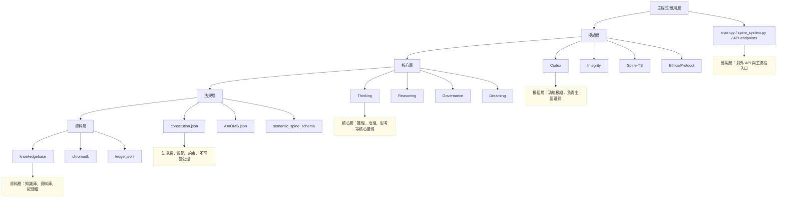

# ToneSoul 倉庫 — 模組依賴關係圖（初版）

> 本圖自動生成，僅供參考。所有註解皆為繁體中文。

---

```mermaid
graph TD
    A[主程式/應用層] --> B[模組層]
    B --> C[核心層]
    C --> D[法規層]
    D --> E[資料層]

    %% 應用層
    A1[main.py / spine_system.py / API endpoints]
    A --> A1

    %% 模組層
    B1[Codex]
    B2[Integrity]
    B3[Spine-TS]
    B4[Ethics/Protocol]
    B --> B1
    B --> B2
    B --> B3
    B --> B4

    %% 核心層
    C1[Thinking]
    C2[Reasoning]
    C3[Governance]
    C4[Dreaming]
    C --> C1
    C --> C2
    C --> C3
    C --> C4

    %% 法規層
    D1[constitution.json]
    D2[AXIOMS.json]
    D3[semantic_spine_schema]
    D --> D1
    D --> D2
    D --> D3

    %% 資料層
    E1[knowledgebase]
    E2[chromadb]
    E3[ledger.jsonl]
    E --> E1
    E --> E2
    E --> E3

    %% 中文說明
    classDef comment fill:#fffbe6,stroke:#bfa,stroke-width:1px;
    Comment1["應用層：對外 API 與主流程入口"]:::comment
    Comment2["模組層：功能模組，負責主要邏輯"]:::comment
    Comment3["核心層：推理、治理、思考等核心邏輯"]:::comment
    Comment4["法規層：規範、約束、不可變公理"]:::comment
    Comment5["資料層：知識庫、資料庫、紀錄檔"]:::comment
    A1 --> Comment1
    B1 --> Comment2
    C1 --> Comment3
    D1 --> Comment4
    E1 --> Comment5
```

---

- 本圖依據 README.md、MODULE_DEPENDENCIES.md 及部分核心程式自動生成。
- 若需更細節（如各 Python 檔案 import 關係），可指定進階分析。
- 下一回合可繼續補充細部模組或跨層依賴。
