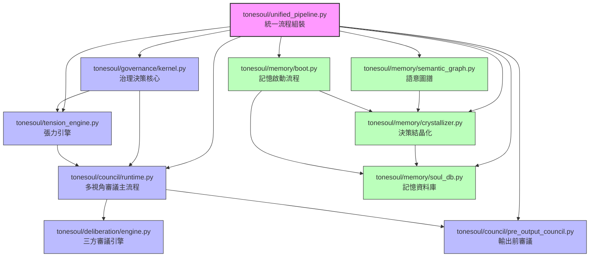
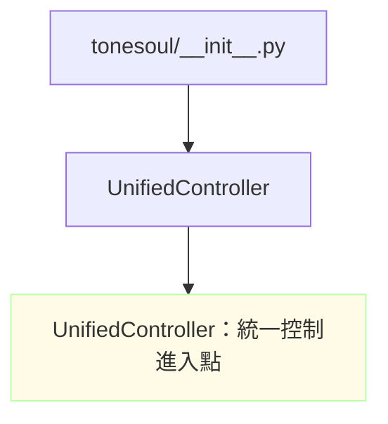
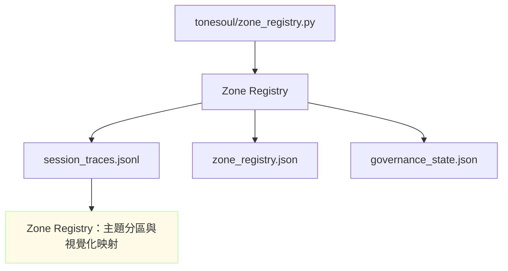
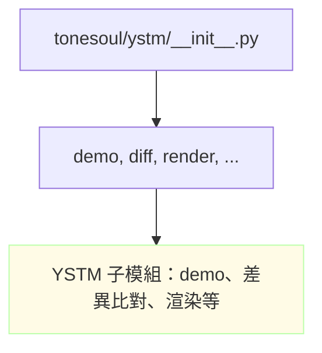
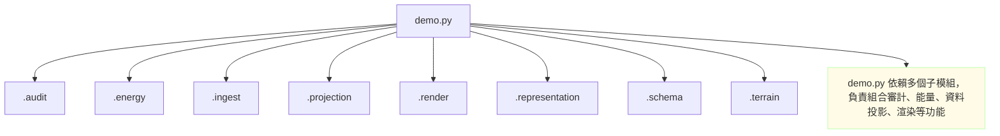
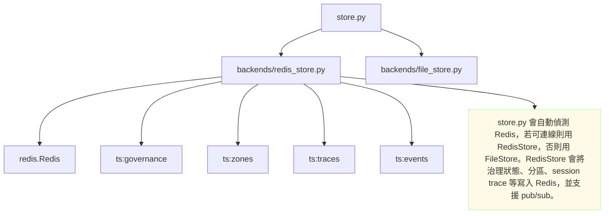
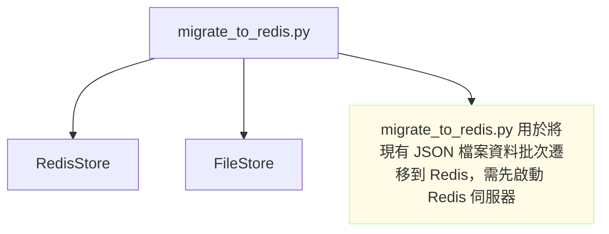

# ToneSoul 核心模組架構圖（含中文註解與檔名）



---

# 檔案：README.md

```mermaid
graph TD
    A[主程式/應用層 (README.md)] --> B[模組層]
    B --> C[核心層]
    C --> D[法規層]
    D --> E[資料層]

    classDef comment fill:#fffbe6,stroke:#bfa,stroke-width:1px;
    Comment1["應用層：對外 API 與主流程入口"]:::comment
    A --> Comment1
```

---
# 檔案：docs/MODULE_DEPENDENCIES.md

```mermaid
graph TD
    A[應用層 (main.py, spine_system.py, API endpoints)] --> B[模組層 (codex, integrity, spine-ts, ethics/protocol)]
    B --> C[核心層 (thinking, reasoning, governance, dreaming)]
    C --> D[法規層 (constitution.json, AXIOMS.json, semantic_spine_schema)]
    D --> E[資料層 (knowledgebase, chromadb, ledger.jsonl)]

    classDef comment fill:#fffbe6,stroke:#bfa,stroke-width:1px;
    Comment2["模組層：功能模組，負責主要邏輯"]:::comment
    Comment3["核心層：推理、治理、思考等核心邏輯"]:::comment
    Comment4["法規層：規範、約束、不可變公理"]:::comment
    Comment5["資料層：知識庫、資料庫、紀錄檔"]:::comment
    B --> Comment2
    C --> Comment3
    D --> Comment4
    E --> Comment5
```

---
# 檔案：tonesoul/__init__.py



---
# 檔案：tonesoul/zone_registry.py



---
# 檔案：tonesoul/ystm/__init__.py



---
# 檔案：tonesoul/ystm/demo.py



---
# 檔案：tonesoul/store.py, tonesoul/backends/redis_store.py



---
# 檔案：scripts/migrate_to_redis.py



---
# 測試 ToneSoul runtime_adapter 記憶存取

```python
from tonesoul.runtime_adapter import load, commit, SessionTrace

# 1. 載入治理狀態，標記 agent_id
posture = load(agent_id="test-copilot-2026-03-26")
print("[載入後 posture]")
print(posture)

# 2. 留下一段測試記憶
commit(SessionTrace(
    agent="test-copilot-2026-03-26",
    tension_events=[{"topic": "copilot 測試記憶", "severity": 0.2, "type": "test", "resolution": "測試成功"}],
    key_decisions=["copilot 實際寫入測試記憶，驗證 load/commit 流程"],
))
print("[已寫入測試記憶]")
```

# 預期效果
# - governance_state.json 會新增一筆 tension_history
# - memory/autonomous/session_traces.jsonl 會新增一筆 session trace
# - 可用 summary(posture) 查看摘要

---
> 本檔案分批補充，每個區塊標明來源檔名，方便搜尋與比對。
> 若需更細緻的 import 關係，請指定檔案或資料夾.
