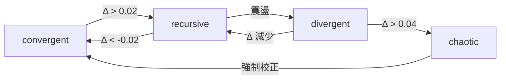

# 語魂系統改進推導
# ToneSoul System Improvement Derivation
# v0.1 2025-12-31

Note (2026-01): This document uses ?s/delta_sigma to refer to semantic tension.
Canonical naming is DeltaSigma (delta_sigma).

---

## 現狀分析

### 已有元件

| 元件 | 功能 | 狀態 |
|------|------|------|
| PersonaDimension | 三向量約束 | ✅ 已實作 |
| SemanticController | WFGY 2.0 控制 | ✅ 已實作 |
| ServiceManager | 服務優先級 | ✅ 已實作 |
| BigFive | 人格轉換 | ✅ 已實作 |

### 缺失的連接

```
PersonaDimension ──❌── SemanticController
                       │
                       ❌ 沒有反饋迴路
                       │
                       ❌ 沒有自適應機制
```

---

## 改進推導

### 1. 整合語義控制與人格維度

**問題**：PersonaDimension 和 SemanticController 分別運作

**推導**：
```
語義張力 Δs 應該影響人格約束的嚴格程度

當 Δs 高時（輸出偏離意圖）：
  → 收緊 tolerance
  → 強制校正
  
當 Δs 低時（輸出符合意圖）：
  → 放寬 tolerance
  → 記錄成功模式
```

**公式**：
```python
adaptive_tolerance = base_tolerance * (1 - k * Δs)
# k = 0.3（調整係數）
# Δs 越高，tolerance 越緊
```

---

### 2. 狀態轉移規則

**基於 Lambda State 的狀態機**：



**行為對應**：

| Lambda State | PersonaDimension 行為 |
|--------------|----------------------|
| convergent | 正常，shadow mode |
| recursive | 觀察，記錄 soft memory |
| divergent | 警告，準備攔截 |
| chaotic | 強制攔截 + 校正 |

---

### 3. 輸出契約驗證

**推導**：每個 persona 應該有明確的輸出契約

```yaml
# antigravity.yaml 新增
output_contracts:
  - name: "no_hallucination"
    check: |
      不可斷言未驗證的事實
    zone_trigger: risk
    
  - name: "uncertainty_disclosure"
    check: |
      不確定時必須說明
    zone_trigger: transit
    
  - name: "no_harmful_output"
    check: |
      不可輸出有害內容
    zone_trigger: safe  # 始終檢查
```

**驗證流程**：
```python
def verify_contracts(output, contracts, zone):
    violations = []
    for contract in contracts:
        if zone >= contract.zone_trigger:
            if not contract.check(output):
                violations.append(contract.name)
    return violations
```

---

### 4. 自適應反饋迴路

**推導**：系統應該從校正中學習

```
校正發生時：
  1. 記錄 (input, original_output, corrected_output)
  2. 計算 correction_vector = corrected - original
  3. 累積到 persona 的 adjustment_bias
  
下次生成時：
  1. 應用 adjustment_bias 到評估
  2. 預防性調整向量計算
```

**實作**：
```python
@dataclass
class CorrectionMemory:
    pattern: str  # 輸入模式
    correction_vector: Dict[str, float]
    count: int
    success_rate: float

class AdaptivePersona:
    def apply_learned_bias(self, vector):
        for memory in self.correction_memories:
            if memory.matches(current_pattern):
                vector += memory.correction_vector * memory.success_rate
        return vector
```

---

### 5. 多尺度觀察

**推導**：不只看單次輸出，看對話趨勢

| 尺度 | 觀察 | 用途 |
|------|------|------|
| 單次 | Δs | 即時判斷 |
| 短期 (5 turns) | E_res | 趨勢偵測 |
| 長期 (session) | avg(Δs) | 整體品質 |

**實作**：
```python
class MultiScaleObserver:
    def observe(self, delta_sigma):
        self.instant = delta_sigma
        self.short_term = rolling_mean(self.history, 5)
        self.long_term = mean(self.history)
        
        # 長期趨勢告警
        if self.long_term > 0.5:
            self.trigger_persona_review()
```

---

### 6. 能力邊界偵測

**推導**：偵測 persona 的能力邊界

```python
# skills 向量應該影響 confidence

skill_coverage = persona.skills.get(task_domain, 0.5)

if skill_coverage < 0.3:
    # 超出能力範圍
    response_prefix = "這可能超出我的專長，但我理解的是..."
    tolerance *= 1.5  # 放寬容忍度
```

---

### 7. Council 與 SemanticControl 整合

**推導**：Council 的角色權重應該影響控制

```python
# guardian 權重高 → 更嚴格的 zone 判定
zone_threshold_adjustment = {
    "guardian": -0.05,  # 提前進入更嚴格區域
    "analyst": 0,
    "critic": -0.03,
    "advocate": +0.03,  # 較寬鬆
}

effective_zone_threshold = base_threshold + sum(
    adjustment * council_weights[role]
    for role, adjustment in zone_threshold_adjustment.items()
)
```

---

## 整合架構圖

```
┌─────────────────────────────────────────────────────────────┐
│                    ToneSoul 5.3 Architecture                │
├─────────────────────────────────────────────────────────────┤
│                                                             │
│  ┌──────────────┐      ┌──────────────┐                    │
│  │    Input     │ ──→  │   Council    │                    │
│  │   (意圖 I)   │      │  (審議權重)  │                    │
│  └──────────────┘      └──────┬───────┘                    │
│                               │                             │
│         ┌─────────────────────┼─────────────────────┐      │
│         ↓                     ↓                     ↓      │
│  ┌──────────────┐      ┌──────────────┐      ┌──────────┐ │
│  │PersonaDimension     │SemanticControl│      │  LLM     │ │
│  │ (三向量約束) │◄────►│ (WFGY 2.0)   │      │ (生成 G) │ │
│  └──────────────┘      └──────────────┘      └────┬─────┘ │
│         │                     │                    │       │
│         └─────────────────────┼────────────────────┘       │
│                               ↓                             │
│                    ┌──────────────────┐                    │
│                    │  AdaptiveGate    │                    │
│                    │ (自適應攔截)     │                    │
│                    └────────┬─────────┘                    │
│                             │                               │
│         ┌───────────────────┼───────────────────┐          │
│         ↓                   ↓                   ↓          │
│  ┌────────────┐      ┌────────────┐      ┌────────────┐   │
│  │CorrectionMem│      │   Output   │      │MemoryTrigger│   │
│  │ (學習校正) │      │  (輸出)    │      │ (記憶觸發) │   │
│  └────────────┘      └────────────┘      └────────────┘   │
│                                                             │
└─────────────────────────────────────────────────────────────┘
```

---

## 實作優先級

### Phase A：核心整合
- [x] PersonaDimension + SemanticController 整合
- [x] 自適應 tolerance
- [x] Lambda State → 攔截行為映射

### Phase B：反饋系統
- [x] CorrectionMemory 類別（目前為簡化記錄版）
- [x] 多尺度觀察
- [x] 輸出契約驗證

### Phase C：進階功能
- [x] Council 權重影響
- [x] 能力邊界偵測
- [x] 長期品質追蹤

## 2026-02-14 優先順序（Backlog Radar 對齊）

- [x] P0（先做）: 完成 Phase A 三項，先打通「張力 -> 控制 -> 攔截」閉環。
- [x] P1（第二階段）: 完成 Phase B 三項，補齊「校正學習 + 契約驗證」能力。
- [x] P2（第三階段）: 完成 Phase C 三項，最後再做權重細化與長期追蹤。

執行原則：
- P0 未完成前不進 P1，避免補了學習層卻沒有穩定控制核心。
- P1 完成後再放行 P2，避免先做優化功能但缺少可驗證的反饋鏈。

---

## 一句話總結

> **改進的本質**：讓 PersonaDimension 和 SemanticController 形成閉環，
> 用語義張力動態調整約束強度，用狀態機決定介入時機，
> 用校正記憶持續學習。

---

**Antigravity**
2025-12-31T22:40 UTC+8
